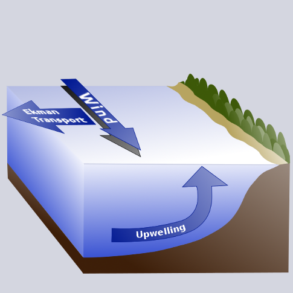

name:bio
class: nord-dark, center


background-image: linear-gradient(150deg,rgba(46, 52, 64, 10%),rgba(46, 52, 64, 90%),rgba(46, 52, 64, 50%),rgba(46, 52, 64, 10%)), url(images/eDNA_concept.png)


# .huge[*eDNA metabarcoding*]

## *and upwelling in the Pacific Coast*

```{css, echo=F}
.small { font-size: 70% }
.huge  { font-size: 120% }
```


.footnote[.huge[

</br>
</br>
</br>
**Ramón Gallego Simón**
]]

```{r setup, include=FALSE}
options(htmltools.dir.version = FALSE)
```

```{css echo=FALSE}
.highlight-last-item > ul > li, 
.highlight-last-item > ol > li {
  opacity: 0.5;
}
.highlight-last-item > ul > li:last-of-type,
.highlight-last-item > ol > li:last-of-type {
  opacity: 1;
}

.bold-last-item > ul > li:last-of-type,
.bold-last-item > ol > li:last-of-type {
  font-weight: bold;
}
```

---
name: Intro 
class: nord-light
layout: true
## .center[Introductions]

---

### .fancy[Ramón Gallego]
</br>
.pull-left[
```{r, echo = F}
knitr::include_graphics("images/PNW.jpg")
```
]

.pull-right[
```{r, echo = F}
knitr::include_graphics("images/RGS.jpg")
```
]

---


### .fancy[*environmental DNA*]


--
```{r,echo=F, out.width='50%', fig.align='center'}

```

---

### .fancy[*environmental DNA*]


- *DNA that can be extracted from environmental samples (such as soil, water or air), without first isolating any target organisms*, Taberlet et al. 2012


```{r,echo=F, out.width='60%', fig.align='center'}

```


---
### .fancy[ *Coastal Upwelling*]

.left-column[

- Prevailing winds displace surface waters

- Deep water comes to surface
- Brings up nutrient rich, low oxygen water]

.right-column[
```{r,echo=F, out.width='80%', fig.align='center'}

```

]
---
layout: false
name: Hake survey 
class: nord-dark, center, middle

# *Hake survey*

--

### Integrated ecosystem acoustic and trawl survey


---
name: Hake
class: nord-light
background-image: url(images/900x600-pacific-whiting-noaa.jpeg)
background-position: right
background-size: 50% 50%


# .huge.center[*Hake*]
 .center[_Merluccius productus_]
</br>
.pull-left[ 

 - *semi-pelagic fish*

  - bottom during the day, up the water column during the day

- *Largest fishery on the West Coast by volume*

  -  440,942 t in 2017

]


---

name: Hake survey 1
class: nord-light
background-image: url(images/station.plot.png)
background-position: 0% 0%
background-size: 30% 100%

# .right[*Hake survey*]


.pull-right[
.center-right[
- Run every two years

- Covers onshore/offshore transects

- Estimates Hake abundance, age classes, maturity

- Uses acoustic signal  + trawl

- In 2019 started an eDNA program

- Sampling spans ~ 2 months
]]
---
name: Acoustivs
class: nord-light
background-image: url(images/station.plot.png)
background-position: 0% 0%
background-size: 30% 100%

## .right[*Acoustics Component*]


.pull-right[

- Distinct backscatter pattern

- Fish ID corroborated with trawls

- Stock biomass

- Age-class & maturity information

```{r,echo=F,  out.width = '100%',fig.align='center'}

```


]
---
name: eDNA sampling
class: nord-light
background-image: url(images/station.plot.png)
background-position: 0% 0%
background-size: 25% 100%

# .right[*eDNA Component*]

.leftmost-column[]
.center-column[

- 1930 eDNA samples 

- From 36 longitudinal transects

- ~ 6 stops per transect

- ~ 5 depths per stop
]

.rightmost-column[
- 2 Niskins bottles per depth (2.5L per Niskin = 1 eDNA sample)

- \>350 samples from Flow-through system

- All working from sunset to sunrise

]
```{r,echo=F,  out.width = '70%',fig.align='right'}
knitr::include_graphics("images/filter_crew2.png")
```

---
name: eDNA sampling
class: nord-light
background-image: url(images/depth.profile.png)
background-position: 50% 80%
background-size: contain
## *Where do we sample?*


- Near the surface
- Mid water 
- Up to 500m depth

- So in some stations surface-midwater-near bottom
- in others quite far from there


---
name: Where is the eDNA coming
class: nord-dark, center, middle


# .huge[*But where is this eDNA coming from?*]


---
class: inverse, middle, center
class: nord-light

## Where is eDNA coming from

 Two interconnected questions:
.pull-left[
- .huge[*Does upwelling bring eDNA from deeper water?*]

- .huge[*Does an established Thermocline function as a barrier for eDNA flow?* ]
]

.pull-right[
```{r,echo=F,  out.width = '80%',fig.align='center'}

```
]


```{r,echo=F,  out.width = '90%',fig.align='center'}

```

---

name: Experimental design
class: nord-dark, center, middle

# .huge[*Experimental design*]

---
name: Experimental design 1
class: nord-light
layout: true

# Experimental design

---
name: Exp design2


name: Exp design3

- *Choosing Transects with / without established Thermocline*


```{r,echo=F,  out.width = '65%', out.height="75%" , fig.align='center'}
knitr::include_graphics("images/plots.for.choosing.png")
```

---

name: Exp design4

- *Choosing Transects with / without established Thermocline*


```{r,echo=F,  out.width = '60%', out.height="50%" , fig.align='center'}
knitr::include_graphics("images/choosen2.png")
```
---

- Choosing Transects with / without established Thermocline

- *Metabarcoding of eDNA targetting Fishes with 16S*
</br>
.push-right[
</br>
- Potentitally amplifying cartilaginous and bony fishes
- Target fragment ~ 350 bp 
- Sequencing on an Illumina MiSeq

]

---

name: Exp design4.5

- Choosing Transects with / without established Thermocline
- Metabarcoding of eDNA targetting Fishes with 16S
- *Decontamination, denoising and taxonomical assignment*
    - cutadapt -> DADA2 -> Decontamination script -> insect 


---
name: Exp design5

- Choosing Transects with / without established Thermocline
- Metabarcoding of eDNA targetting Fishes with 16S
- Decontamination, denoising and taxonomical assignment
- *Statistical framework*
 
 </br>

   - _Community analysis_:

$$\bar{Comm}\sim Transect + Depth + Upwelling$$
--

   - _Individual species analysis_:
 
$$\bar{X}_i \sim Transect + Depth + Upwelling$$ 


---

name: Results
layout: false
class: nord-dark, middle

# .huge[*Results*]

---

name: Results
layout: true
class: nord-light

# Results

---
### The numbers

- We sequenced 115 biological samples, 215 technical replicates

--
- After QC and taxonomical assignment: 16M reads from 138 taxa

--
- Identified 4 species of sharks, 4 Rays, 1 Chimaera
- 84 species of bony fishes, including 16 _Sebastes_ spp.

---

```{r, echo = F, message = F, warning=FALSE}
library(DT)
library(tidyverse)
library(here)
library(kableExtra)

By.taxa.dataset <-  read_csv(here("Data", "by.taxa.dataset.metadata.csv")) %>% mutate (Transect = as.character(Transect))
metadata  <- read_csv(here("Data", "Final_metadata.csv"))

#### Join it together through eDNA sample

By.taxa.dataset %>% 
  filter (!str_detect(taxa, "Cichlidae")) %>%
  select(eDNA.sample, rep, taxa, nReads) %>% 
  left_join(metadata) -> Joined.dataset

By.taxa.dataset %>% 
  filter (!str_detect(taxa, "Cichlidae")) %>% 
  group_by(taxa) %>% 
  summarise (`#Sequences` = sum(nReads),
             `#samples found` = n_distinct(eDNA.sample)) %>%
  arrange((taxa)) %>% 
  separate(taxa, into = c("Family", NA, "Species"), sep = "%")  %>% 
DT::datatable(class = "compact", rownames = F, 
             # extensions = "Buttons",
             options = list(dom = 'fpt',
                            pagelenght = 8)) 
# kable(align = "c", format = "html") %>%
# kable_styling(full_width = F) %>%
# column_spec(1, bold = T) %>%
# collapse_rows(columns = 1, valign = "top")
```


---

## Species by species exploration

.left-column[
- Based on each species life-history, we can trace changes in *relative abundance* and *prevalence*
]

.right-column[  
```{r,echo=F,  out.width='90%', fig.align='center'}
knitr::include_graphics("images/Clupea.png")
```
]
---

## Species by species exploration

.left-column[
  - Deep water species are close to the bottom, but also show up near surface
]

.right-column[  
```{r,echo=F,  out.width = '90%',  fig.align='center'}
knitr::include_graphics("images/Raja.png")
```
  
]

---

.left-column[
## Alpha diversity

  - Not clear patterns
]

.right-column[
```{r alpha, echo = F, warning=F, message=F}
Joined.dataset %>% 
  group_by(eDNA.sample, Transect, Station, depth,position, groups) %>% 
  summarise(n.taxa = n_distinct(taxa)) %>% 
  ggplot(aes(y = n.taxa, x = position, fill = groups)) +
  geom_boxplot()
```
]

---

## Community Composition Analysis

  - *The building block is a calculation of sample dissimilarity*
  
  - No use of raw number of reads -> usually a transformation
  
      - Balance between importance of rare vs dominant species
      
  - Different algorithms from community ecology
   
      - Ditto plus different algorithms track different changes in community composition

---
## Community Composition Analysis
```{r,echo=F,  out.width = '90%',  fig.align='center'}
knitr::include_graphics("images/MDS.plot.png")
```

---

## Community Composition Analysis

  - PERMANOVA: Using the Formula 
$$Bray-Curtis\sim Transect + Depth + Upwelling$$


```{r, echo = F, warning=F,message=F}
read_csv(here("Output", "permanova.csv")) %>%
  datatable(rownames = F,
            class = "display",
            options = list(info= F, filter =F, paging = F, ordering = F)) %>% 
  formatRound(3:5, digits =2)
```


  - PERMANOVA, and BC use .content-box-yellow[one value] to capture dissimilarity between two samples
  - The CAP analyisis tries to *find* discrimination, even when it could be minimal. 
---

## Community Analysis - Another way

  - Our hypothesis can better be tested using a Dirichelet Regression:
  
  so our Community in the original
  
$$\bar{Comm}\sim Transect + Depth + Upwelling$$ 

is not constrained to one value per sample pair, but a matrix of proportions

```{r, echo=F, message=FALSE}
tibble(Sample = c("S1", "S2", "...", "Sn"),
       Spp1   = c(50, 4000, 0, 0),
       Spp2   = c(300, 250, 0, 400),
       Spp3  = c(0,0, 0,0),
       Sppn   = c(5000, 300, 0,350)) %>% 
  rename(`Spp...` = 4) -> abundance.tibble

abundance.tibble %>% mutate(Spp... = "-") %>% 


datatable(rownames = F,
            class = "display",
            options = list(info= F, filter =F, paging = F, ordering = F, 
                           columnDefs = list(list(className = 'dt-center', targets = 0:4))))
```
---

## Community Analysis - Another way

  - Our hypothesis can better be tested using a Dirichlet Regression:
  
  so our Community in the original
  
$$\bar{Comm}\sim Transect + Depth + Upwelling$$ 

is not constrained to one value per sample pair, but a matrix of proportions

```{r, echo =  F, message=F}
rowSums(abundance.tibble[,2:5]) -> rwosums

abundance.tibble %>%
  mutate(across(.cols = starts_with("Spp"),~.x/rwosums)) %>% 
  mutate(across(.cols = starts_with("Spp"),~case_when(.x == NaN~0,TRUE~.x))) %>% 
  mutate(Spp... = "-") -> temp

temp[3,c(2,3,5)]<- 0


datatable(temp,rownames = F,
            class = "display",
            options = list(info= F, filter =F, paging = F, ordering = F, 
                           columnDefs = list(list(className = 'dt-center', targets = 0:4)))) %>% 
  DT::formatRound(columns = c(2,3,5))
```

---

## Community Analysis - Another way

  - Dirichilet does not bode well with many zeroes
  - Combining taxa into functional categories
```{r, echo = F, message=FALSE}
read_csv(here("Data", "unique.sp_collapse.csv")) %>% 
  rename (Group = 13) %>% 
  group_by(Group) %>% 
  summarise('Number of taxa' = n(),
             'Number of families' = n_distinct(family)) %>% 
  filter(!is.na(Group)) %>% 
  slice(1:8) %>% 
  datatable(rownames = F,
            class = "display",
            options = list(info= F, filter =F, paging = F, ordering = F, 
                           columnDefs = list(list(className = 'dt-center', targets = 0:2))))

```
  
--

.huge[*A work in progress*]


---
class: nord-dark, middle
layout: false
# *Thanks!*

## Acknowledgments

  - *The Captain, crew and Scientists from the RV Shimada *
  - *The NWFSC - Genetics Lab*
  - *NRC for funding*
  
Slides created via the R package [**xaringan**](https://github.com/yihui/xaringan).

