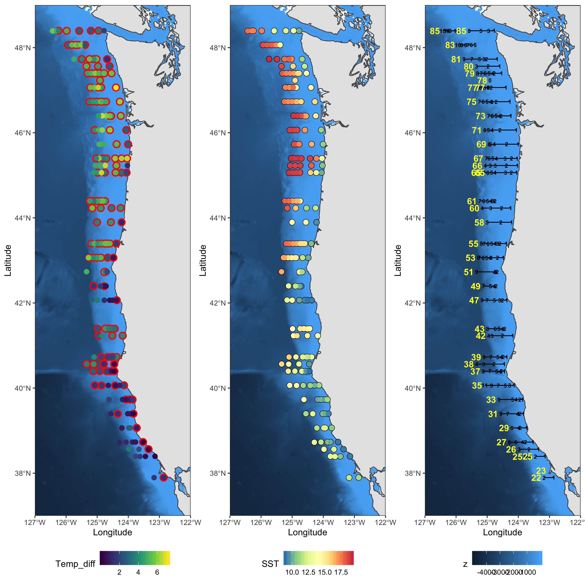

```{r setup, include=FALSE}
knitr::opts_chunk$set(echo = TRUE)
```

## R Markdown

This is an R Markdown document. Markdown is a simple formatting syntax for authoring HTML, PDF, and MS Word documents. For more details on using R Markdown see <http://rmarkdown.rstudio.com>.

When you click the **Knit** button a document will be generated that includes both content as well as the output of any embedded R code chunks within the document. You can embed an R code chunk like this:

```{r libraries}
library(tidyverse)
library(here)
```

## Including Plots

You can also embed plots, for example:

```{r load dataset}
eDNA.samples <- read_csv(file = here("Data", "eDNA hake water samples.csv")) %>% 
  rename(Station = `CTD cast`)
CTD.stations <- read_csv(file = here("Data", "cleaned_CTD_stations.csv"))


```

We want to choose 8 transects that reflect the differences in latitude, strength of thermocline and its depth




And the winners are transects 81, 77, 67, 60, 53, 39, 35, 26. From them we will choose the stations closest to shore, the furthest and one in between


```{r joining}

eDNA.samples %>% 
  left_join(CTD.stations) %>% 
  separate(Station, into = c("Transect","position"), remove = F) %>% 
  filter (Transect %in% c(81, 77,67,60,53,39,35,26)) %>% 
  select(Transect, position, depth, `Tube #`, lat, lon) %>% 
  distinct() -> eDNA.samples.transects 
  
  eDNA.samples.transects %>% 
    select(eDNA.sample = `Tube #`, everything()) %>% 
    write_csv(here("Data", "eDNA.samples.with.lat.lon.csv"))

```

## On Feb 24th, adding samples from the bottom-most bottles for each transect

The idea is to model the similarity in species composition between samples from surface and bottom in transects with upwelling.

So far these are the samples chose for sequencing
```{r}
Plate22 <- read_csv(here("Data", "Samples_To_Sequence", "plate22.csv")) %>% 
  pivot_longer(-Row, names_to = "Column", values_to = "sample") %>% 
  mutate (Plate = "Plate22")

Plate23 <- read_csv(here("Data", "Samples_To_Sequence", "plate23.csv")) %>% 
  pivot_longer(-Row, names_to = "Column", values_to = "sample") %>% 
  mutate (Plate = "Plate23")

Samples_to_Sequence <- bind_rows(Plate22, Plate23)


```
Let's join that with depth

```{r}
left_join(Samples_to_Sequence, eDNA.samples.transects %>% 
    select(sample = `Tube #`, everything())) -> joined.data

joined.data %>% tally_wide(rows = Transect,
                           cols = depth)

joined.data %>% 
  filter (!is.na(Transect)) -> joined.data

joined.data %>% distinct(depth)
```


So for each of those transects & stations, we need to keep the deepest bottles

```{r}
eDNA.samples.transects %>% 
  select(sample = `Tube #`, everything()) %>%
  semi_join(joined.data, by = c("Transect", "position")) %>% 
  mutate (depth = case_when(depth == "sfc" ~ "0",
                            TRUE           ~ depth),
          depth = as.numeric(depth)) %>% 
  group_by(Transect, position) %>% 
  mutate (maxdepth = max(depth)) %>% 
  filter (depth == maxdepth) %>% # these are the deepest samples for each of the stations - 48 samples 
  anti_join (joined.data, by = c("sample")) %>% # And these 34 are those to keep
  write_csv(here("Data", "Samples_To_Sequence","new.samples.at.depth.csv"))
```

```{r}

plate.info <- read_csv(here("Data", "Samples_To_Sequence","Hake_eDNA_2019_plates_layout_long.csv"), col_types = "ccdc")

samples.to.seq <- read_csv(here("Data", "Samples_To_Sequence","new.samples.at.depth.csv"))

samples.to.seq %>% 
  left_join(plate.info) %>% 
  unite (row, col,col = "well", sep ="" ) %>% 
  write_csv(here("Data", "Samples_To_Sequence","new.samples.at.depth.with.plate.csv"))

```

