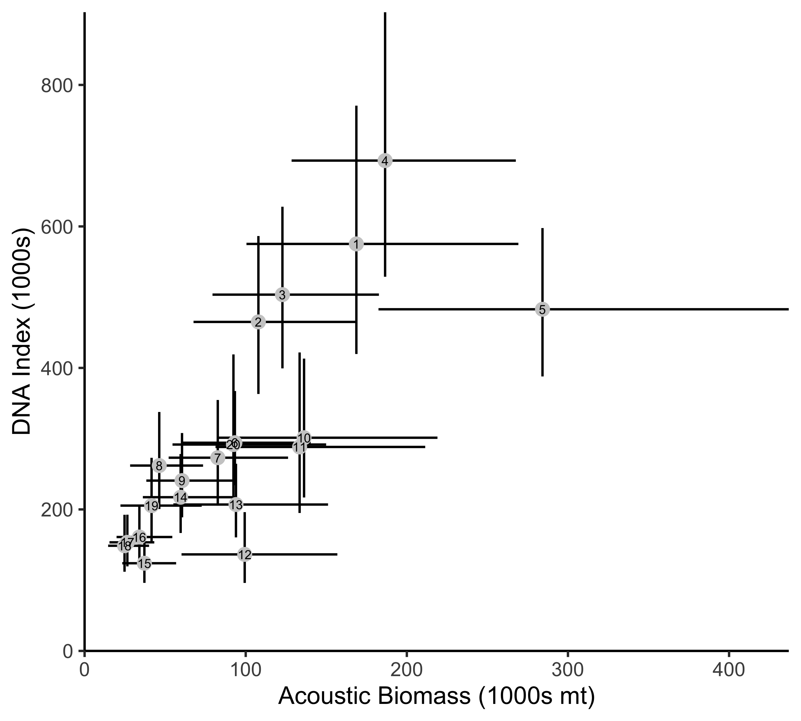

```{r setup, include=FALSE}
knitr::opts_chunk$set(echo = FALSE)

load("../Stan Model Fits/_Summarized_Output/Qpcr_summaries_lat.long.smooth_Base_Var_4_10_fix_nu_T.RData")

library(dplyr)
library(ggplot2)
```

## Environmental DNA analysis

This section provides detailed information about the analysis of eDNA. The statistical model for eDNA is presented in the main text.

### Standards

For each qPCR plate, we included known samples with a known number of hake DNA copies to allow us to translate the observed PCR cycle at which amplification occurred to the number of copies in a sample. We present both the relationship for the PCR cycle at which amplification was observed  (Fig. \ref{fig:stand}) and the probability of observing amplification at different DNA copy numbers (Fig. \ref{fig:stand.pres}). The analysis of standard show that our qPCR analyses were sensitive to very low copy numbers and consistent across plates.
 
```{r fig.stand, echo=FALSE,fig.cap="\\label{fig:stand} qPCR standards for 33 plates with DNA copy numbers ranging from 1 to 100,000." ,out.width='100%'}
print(Output.summary.qpcr$stand.plot)
```

```{r fig.stand.pres, echo=FALSE,fig.cap="\\label{fig:stand.pres} Amplification success for qPCR standards for 33 plates with DNA copy numbers ranging from 1 to 100,000.",out.width='75%'}
print(Output.summary.qpcr$stand.plot.pres)
```

### Investigations of contamination.

In addition to field samples, we collected two kinds of control samples ship board to look for potential contamination of samples during sample processing. We found low levels of contamination in while control samples.  While 18 of 49 had hake DNA below the detection limit of 20 $copies L^{-1}$, 31 had higher concentrations. Of these 31 samples, most (21 samples) had very low concentrations $<100 copies L^{-1}$ but there was a single sample with $>$ $500$ $copies L^{-1}$ (Fig. \ref{fig:contam.hist}). From these observations, we estimated the parameters from a log-normal distribution to describe the distribution of hake DNA from contamination (Fig. \ref{fig:contam.hist}; posterior mean estimates:
$\mu$ = `r round(Output.summary.qpcr$mu_contam_out$Mean[Output.summary.qpcr$mu_contam_out$type=="liter"],3)`, $\sigma =$ `r round(Output.summary.qpcr$sigma_contam_out$Mean,3)`).This corresponds to an expected contribution of `r round(exp(Output.summary.qpcr$mu_contam_out$Mean[Output.summary.qpcr$mu_contam_out$type=="liter"] + 0.5*Output.summary.qpcr$sigma_contam_out$Mean^2),1)` copies per liter per sample. For this distribution 92% of samples would be expected to have less than 100 $copies$ $L^{-1}$ but there will be a small number of more significantly contaminated samples. We remain unsure of the ultimate source of contamination in these samples and are conducting 

To understand the potential effect of contamination on our results, we first plotted the estimated distribution from contamination against the estimates of hake DNA concentration in field samples (Fig. \ref{fig:contam.facet}). The observed hake DNA distributions were all substantially larger than estimated contamination distribution. So while contamination may be playing a minor role in determining the observed hake DNA, it is not the dominant factor determining the spatial or depth specific distribution of DNA. We cannot identify which samples have a significant contribution of contamination but there is no suggestion that the contamination has a spatial or depth-specific effect.

MORE?


```{r fig.contam.hist,message=FALSE, warning=FALSE, echo=FALSE,fig.cap="\\label{fig:contam.hist} Histogram of point estimates for hake DNA copies per L from the two types of field control samples (N=49).  Blue line shows estimated lognormal distribution from the observed hake copies per L." ,out.width='80%'}
print(Output.summary.qpcr$control.hist)
```

```{r fig.contam.facet, message=FALSE, warning=FALSE, echo=FALSE,fig.cap="\\label{fig:contam.facet} Empirical histograms of estimated hake DNA copies per L for individual samples at six water depths (purple) and estimated distribution of contamination derived from control samples. Vertical dashed line shows 20 copies per L, the putative detection threshold for our methodology. ",out.width='100%'}
print(Output.summary.qpcr$depth.hist.facet)
```

### Inhibition

As part of our qPCR protocol [@ramon-laca2021PLOS], we included an internal positive control (IPC) of the reaction to account for PCR inhibition. Any sample that had a difference of more that 0.5 PCR cycle from the IPC was considered to be inhibited.  Inhibited samples were initially purified using an inhibitor removal column and thereafter diluted 1:2, 1:5 and 1:10 to circumvent inhibition and requantified. We detected inhibition primarily in the near-surface samples (Fig. \ref{fig:inhibition.depth}). After inspection of qPCR results following dilution, we included only 1:5 dilution samples in the final statistical model.

```{r fig.inhibition.depth , echo=FALSE,fig.cap="\\label{fig:inhibition.depth} Samples that were identified as being inhibited by sample depths.  Samples identified as being inhibited were diluted and re-run using quantitative PCR. ",out.width='100%'}
print(Output.summary.qpcr$inhibit.plot.by.depth)
```

### Ethanol wash error

For a subset of samples, DNA extraction was incorrectly washed with overdiluted ethanol at the final desalting step of the DNA purification. Specifically, samples were washed with a 30\% ethanol solution instead of a 70% ethanol solution. Affected samples lost of some DNA during the washing processes. Washed bottles were geographically restricted to the northern part of the sample area, but occurred across all sample depths (Fig. \ref{fig:wash.plot}). To examine the magnitude of this problem, we experimentally divided samples taken from 26 individual station-depth combinations and subjected one bottle taken from those stations to the proper 70% ethanol wash and for the paired bottle used a 30% ethanol wash. This paired design allowed us to estimate the magnitude of the DNA concentration lost due to the wash error.  

Within the model we estimate that this washing error led to $\omega =$`r Output.summary.qpcr$stanMod_summary_parts$param['wash_offset','mean'] %>% round(.,2)` 
[`r Output.summary.qpcr$stanMod_summary_parts$param['wash_offset','2.5%'] %>% round(.,2) `,
`r Output.summary.qpcr$stanMod_summary_parts$param['wash_offset','97.5%'] %>% round(.,2) `] (mean [95% CI]), which traslates to approximately `r ((1-10^(Output.summary.qpcr$stanMod_summary_parts$param['wash_offset','mean'])) * 100) %>% round(.,2)`% of the DNA being lost due to the ethanol wash error (Fig. \ref{fig:wash.hist}).

```{r fig.wash.plot , echo=FALSE,fig.cap="\\label{fig:wash.plot} Samples that were identified using the overdiluted ethanol wash. Samples identified as being diluted were included in the statistical model.",out.width='75%'}
print(Output.summary.qpcr$wash.plot + theme(legend.position="none"))
```

```{r fig.wash.hist , echo=FALSE,fig.cap="\\label{fig:wash.hist} Posterior estimat of OMEGA, the offset due to the ethanol was error. Vertical dashed line indicates posterior mean. ",out.width='60%'}
print(Output.summary.qpcr$wash.param.hist)
```

\newpage
\clearpage

## eDNA model

### Marginal DNA concentration with depth

The maps presented in the main text show spatial variation in DNA concentration it can also be informative to examine generalize patterns of DNA concentration across both bottom and the water depth at sampling. We found strong patterns of DNA concentration varying with depth when averaged across space (Fig. \ref{fig:marg.conc}). Overall, Fig. \ref{fig:marg.conc} shows that the highest concentration of hake DNA occurs in at water depths of 150m and 300m associated with the continental shelf break (bottom depths between 125 and 400m).  This distribution of DNA matches the published depth distribution of hake from acoustic and other traditional survey methods [e.g. @agostini2006relationship] which identify the depth of maximum hake abundance near the continental shelf break and in water depths between 150 and 250m.

```{r fig.marg.conc , echo=FALSE,fig.cap="\\label{fig:marg.conc} Posterior estimates of D_xyd (the hake DNA concentration at each station-depth combination) by the water depth sampled and categories of the depth of the bottom. The distribution of mean D_xyd among station-depths (mean, interquartile range, and 90 CI among station-depths). Bottles at a sample location become increasingly similar at deeper sampling depths ",out.width='75%'}
print(Output.summary.qpcr$marginal_est_D_by_depth)
```

### CV maps for eDNA
```{r fig.cv.maps , echo=FALSE,fig.cap="\\label{fig:cv.maps} Posterior estimates of the CV of hake DNA concentration by sampled depth",out.width='150%'}
print(Output.summary.qpcr$p_D_CV_facet)
```

### Comparison of eDNA and Acoustics (fig. 2 main text) but with 0.5 degree breaks.

Need to add the map just like figure 2 in main text.
```{r fig.pairwise, echo=FALSE,fig.cap="\\label{fig:pairwise} Pairwise comparison between  DNA and acoustics-derived biomass. Correlation between methods among the 20, half degree bins (posterior mean, 90 CI; RHO = 0.74). Numbers indicate associated region identified in Fig. 2.  ", out.width='100%'}

```


### Sources of Uncertainty

```{r fig.bottle.var.depth , echo=FALSE,fig.cap="\\label{fig:bottle.var.depth} Estimates of TAU (log10 standard deviation of hake eDNA concentration between bottles at a single station-depth) for each sampling depth (posterior mean and 90 CI shown). Bottles at a sample location become increasingly similar at deeper sampling depths ",out.width='75%'}
print(Output.summary.qpcr$tau.sample.by.depth)
```

### Raw predicted-observed plots for both models.

```{r fig.pred.obs.edna , echo=FALSE,fig.cap="\\label{fig:pred.obs.edna} Predicted vs. observed plots by sample depth. D_xyd (predicted mean) vs D_xydi (observed in each Niskin bottle).",out.width='75%'}
print(Output.summary.qpcr$p_resid$p2)
```

Add plot of Eta and Sigma.
<!-- ```{r fig.pcr.var , echo=FALSE,fig.cap="\\label{fig:pcr.var} Estimates of ETA (among PCR replicate variation for field samples)",out.width='75%'} -->
<!-- print(Output.summary.qpcr$sigma.pcr.param ) -->
<!-- ``` -->


### Table of prior distributions for eDNA


## Acoustic-Trawl model

### Table of prior distributions for acoustic-trawl suvey

### Components of the acoustic model - pres-abs, positive, unconditional

### Pred - Obs plots

### Posterior variance for acoustics 

### Table of prior distributions for all model parameters

## Citations
