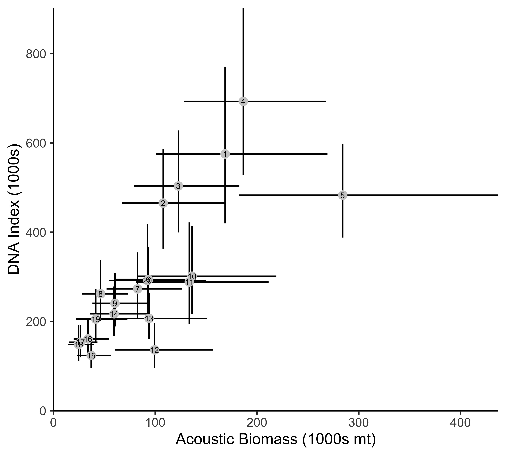

\renewcommand{\thefigure}{S\arabic{figure}}
\setcounter{figure}{0}

\renewcommand{\thetable}{S\arabic{table}}
\setcounter{table}{0}

```{r setup, include=FALSE}
knitr::opts_chunk$set(echo = FALSE)

load("../Stan Model Fits/_Summarized_Output/Qpcr_summaries_lat.long.smooth_Base_Var_4_10_fix_nu_T-FIN_NoSURF=FALSE.RData")
load("../Stan Model Fits/_Summarized_Output/Acoustics 2019 lat.long.smooth 6_14_6_10_smooth_hurdle Base_Var Derived Q.RData")

library(dplyr)
library(ggplot2)
library(gridExtra)
```

\clearpage

# Environmental DNA laboratory analysis details and diagnostics

This section provides detailed information about the analysis of eDNA collected during the 2019 US-Canada Integrated Ecosystem and Pacific Hake Acoustic-Trawl Survey [@deBlois2020survey]. The statistical model for eDNA is presented in the main text. Sample collection, filtration, preservation, DNA extraction, and qPCR protocols are presented in a companion publication [@ramon-laca2021PLOS]. Samples analyzed here were filtered shipboard and preserved within hours of water collection but were stored for between 6 and 14 months before DNA extraction.

### Standards

For each qPCR plate, we included samples with a known number of hake DNA copies to allow us to translate the observed PCR cycle at which amplification occurred to the number of copies in a sample. We present both the relationship for the PCR cycle at which amplification was observed  (Fig. \ref{fig:stand}) and the probability of observing amplification at different DNA copy numbers (Fig. \ref{fig:stand.pres}).  We followed [@ramon-laca2021PLOS] for creating standard curves but with threee additional replicates at 5 $copies$ $\mu L^{-1}$ and six replicates at 1 $copies$ $\mu L^{-1}$.  The analysis of standards shows that our qPCR analyses were sensitive to very low copy numbers and consistent across plates.
 
```{r fig.stand, echo=FALSE,fig.cap="\\label{fig:stand} qPCR standards for 33 plates with DNA copy numbers ranging from 1 to 100,000." ,out.width='100%'}
print(Output.summary.qpcr$stand.plot)
```

```{r fig.stand.pres, echo=FALSE,fig.cap="\\label{fig:stand.pres} Amplification success for qPCR standards for 33 plates with DNA copy numbers ranging from 1 to 100,000.",out.width='75%'}
print(Output.summary.qpcr$stand.plot.pres)
```

### Investigations of contamination.

In addition to field samples, we collected control samples ship board to look for potential contamination of samples during sample processing. We collected 2 L of distilled water from either the onboard evaporator or from distilled water brought from the laboratory
for this purpose ($N=49$). We found low levels of contamination in both types of control samples and lump them together for further analysis.  While 18 of 49 had hake DNA below the detection limit of 20 $copies L^{-1}$, 31 had higher concentrations. Of these 31 samples, most (21 samples) had very low concentrations $<100$ $copies L^{-1}$ but there was a single sample with $>500$ $copies L^{-1}$ (Fig. \ref{fig:contam.hist}). From these observations, we estimated the parameters from a log-normal distribution to describe the distribution of hake DNA from contamination (Fig. \ref{fig:contam.hist}; posterior mean estimates:
$\mu$ = `r round(Output.summary.qpcr$mu_contam_out$Mean[Output.summary.qpcr$mu_contam_out$type=="liter"],3)`, $\sigma =$ `r round(Output.summary.qpcr$sigma_contam_out$Mean,3)`).This corresponds to an expected contribution of `r round(exp(Output.summary.qpcr$mu_contam_out$Mean[Output.summary.qpcr$mu_contam_out$type=="liter"] + 0.5*Output.summary.qpcr$sigma_contam_out$Mean^2),1)` copies per liter per sample. For this distribution 92% of samples would be expected to have less than 100 *copies* $L^{-1}$ but there will be a small number of more significantly contaminated samples. We remain unsure of the ultimate source of contamination in these samples but are conducting additional sampling during the survey cruise of 2021 to identify and eliminate contamination.

Numerous negative controls PCR were included in each qPCR plate and these controls showed no amplification.

To understand the potential effect of contamination on our results, we first plotted the estimated distribution from contamination against the estimates of hake DNA concentration in field samples (Fig. \ref{fig:contam.facet}). The observed hake DNA distributions were all substantially larger than estimated contamination distribution. So while contamination may be playing a minor role in determining the observed hake DNA, it is not a dominant factor determining the spatial or depth specific distribution of DNA. We cannot identify which samples have a significant contribution of contamination but there is no suggestion that the contamination has a spatial or depth-specific effect. Such contamination will have a minor effect on the overall DNA abundance, producing a slight upward bias in the eDNA index.  However, as such contamination is a uniform offset among all samples, it will have no broad-scale effect on the correlations between eDNA and acoustic-trawl results in 2019. 

```{r fig.contam.hist,message=FALSE, warning=FALSE, echo=FALSE,fig.cap="\\label{fig:contam.hist} Histogram of point estimates for hake DNA copies per L from the two types of field control samples (N=49).  Blue line shows estimated lognormal distribution from the observed hake copies per L." ,out.width='80%'}
print(Output.summary.qpcr$control.hist)
```

```{r fig.contam.facet, message=FALSE, warning=FALSE, echo=FALSE,fig.cap="\\label{fig:contam.facet} Empirical histograms of estimated hake DNA copies per L for individual samples at six water depths (purple) and estimated distribution of contamination derived from control samples. Vertical dashed line shows 20 copies per L, the putative detection threshold for our methodology. Note that the x-axis is on the log 10 scale." ,out.width='100%',out.height='100%'}
print(Output.summary.qpcr$depth.hist.facet)
```

### Inhibition

As part of our qPCR protocol [@ramon-laca2021PLOS], we included an internal positive control (IPC) of the reaction to account for PCR inhibition. Any delay of more than 0.5 cycles from the IPC at the non-template controls of the PCR was considered inhibition. Inhibited samples were initially purified using an inhibitor removal column and thereafter diluted 1:2, 1:5 and 1:10 to circumvent inhibition and requantified. We detected inhibition primarily in the near-surface samples (Fig. \ref{fig:inhibition.depth}). After inspection of qPCR results following dilution, we included only 1:5 dilution samples in the final statistical model.

```{r fig.inhibition.depth , echo=FALSE,fig.cap="\\label{fig:inhibition.depth} Samples that were identified as being inhibited by sample depths.  Samples identified as being inhibited were diluted and re-run using quantitative PCR. ",out.width='90%',out.height='90%'}
print(Output.summary.qpcr$inhibit.plot.by.depth +
        theme(axis.text = element_text(size = 6),
              axis.title = element_text(size = 8),
              axis.text.x = element_text(angle = 45,hjust=1),
              legend.text = element_text(size = 6),
              legend.title = element_text(size = 8)))
```

### Ethanol wash error

For a subset of samples, DNA extraction was incorrectly washed with overdiluted ethanol at the final desalting step of the DNA purification. Specifically, samples were washed with a 30\% ethanol solution instead of a 70% ethanol solution. Affected samples lost of some DNA during the washing processes. Washed bottles were geographically restricted to the northern part of the sample area, but occurred across all sample depths (Fig. \ref{fig:wash.plot}). To examine the magnitude of this problem, we experimentally divided samples taken from 26 individual station-depth combinations and subjected one bottle taken from those stations to the proper 70% ethanol wash and for the paired bottle used a 30% ethanol wash. This paired design allowed us to estimate the magnitude of the DNA concentration lost due to the wash error.  

Within the model we estimate that this washing error led to $\omega =$`r Output.summary.qpcr$stanMod_summary_parts$param['wash_offset','mean'] %>% round(.,2)` 
[`r Output.summary.qpcr$stanMod_summary_parts$param['wash_offset','2.5%'] %>% round(.,2) `,
`r Output.summary.qpcr$stanMod_summary_parts$param['wash_offset','97.5%'] %>% round(.,2) `] (mean [95% CI]), which traslates to approximately `r ((1-10^(Output.summary.qpcr$stanMod_summary_parts$param['wash_offset','mean'])) * 100) %>% round(.,2)`% of the DNA being lost due to the ethanol wash error (Fig. \ref{fig:wash.hist}).

```{r fig.wash.plot , echo=FALSE,fig.cap="\\label{fig:wash.plot} Samples that were identified using the overdiluted ethanol wash. Samples identified as being diluted were included in the statistical model.",out.width='75%'}
print(Output.summary.qpcr$wash.plot + theme(legend.position="none"))
```

```{r fig.wash.hist , echo=FALSE,fig.cap="\\label{fig:wash.hist} Posterior estimate of OMEGA, the offset due to the ethanol was error. Vertical dashed line indicates posterior mean. ",out.width='60%'}
print(Output.summary.qpcr$wash.param.hist)
```

\newpage
\clearpage

# eDNA model: fit, diagnostics, and supplementary figures

### Model for qPCR standards

In addition to the model presented in the main text, we have to include a model for the qPCR data of the known concentration standards. For completeness, we describe that component here.

To calibrate the relationship between the number of DNA copies and PCR
cycle, each PCR plate has replicate samples with a known number of DNA
copies. These standards span six orders of magnitude (1 to 100,000
copies) and determine the relationship between copy number and PCR cycle
of detection. Let \(K_j\) be the known copy number in PCR plate \(j\),
then,

\begin{align}
  G_{jr} &\sim Bernoulli(\phi_{0j}+\phi_{1j}\log_{10}K_{j})\\
  C_{jr} &\sim Normal(\beta_{0j}+\beta_{1j}\log_{10}K_{j},\sigma) \quad  if \: G_{jr} =1
\end{align} 

where for the standards we do not allow for heavy tails in
the observed PCR counts and use a normal likelihood rather than a
T-distributed likelihood.

Note that the use of standards provides an explicit model for the
detection threshold of eDNA when using qPCR and this detection threshold
can be directly incorporated to understand the ability to measure DNA
concentrations in field samples. We use diffuse prior distributions for
all parameters (Table S1).


### eDNA model structure and priors

During prelimiary model fits, we investigated a range of knot densities used to describe smooth terms.  To balance computational speed and model flexibility, we settled on using 5 knots for the bottom depth smooth and a 4 (longitudinal axis) by 10 (latitudinal axis) knot grid for the tensor-smoothes. Model results are largely insensitive to knot density.

Prior distributions for all parameters are presented in Table S1.1. We utilize the package *brms* to generate design matrices necessary to estimate smooth terms. Thus we use the random effect representation of smoothes to estimate the model as a generalized linear mixed model. This is equivalent to using the $t2()$ function in the commonly used *mgcv* package for GAMs. This represents the non-linear components of the spline basis as random effects and their associated variance parameters control the wiggliness of the estimated splines [@brms2017; @brms2018].

| Parameter & Prior | Description |
|    :---   | :--- |
| Process Model Components ($D_{xyd}$)|  |
| $\gamma_d \sim Normal(0,5)$|Spatial intercept for DNA concentration at each depth $d$ |
| $b_s \sim Normal(0,5)$| Linear component for each spline and tensor smooth |
| $s_k \sim Normal(0,\xi_k)$| Value for spline knot $k$  |
| $\xi_k \sim T(3,0,2.5)$| Standard deviation for spline knot $k$  |
|  |  |
| Observation Model Components | |
| $\tau \sim Normal(0,2)$|Standard deviation for among Niskin bottle |
| $\omega \sim Normal(-1,1)$|Ethanol wash offset|
| $\phi_0 \sim Normal(2,2)$|PCR amplification detection intercept|
| $\phi_1 \sim Normal(4,2)$| PCR amplification detection slope|
| $\nu = 3$|T-distribution degrees of freedom (fixed)|
| $\beta_0 \sim Normal(38,4)$| PCR amplification standards intercept|
| $\beta_1 \sim Normal(-3.22,0.1)$| PCR amplification standards slope|
| $\sigma \sim Half-Normal(0,2)$| PCR amplification standards standard deviation|
| $\eta \sim  Half-Normal(0,2)$| PCR amplification field samples scale parameter|

Table: Prior and parameter descriptions for the eDNA Model.


<!--
### Marginal DNA concentration with depth

The maps presented in the main text show spatial variation in DNA concentration it can also be informative to examine generalize patterns of DNA concentration across both bottom and the water depth at sampling. We found strong patterns of DNA concentration varying with depth when averaged across space (Fig. \ref{fig:marg.conc}). Overall, Fig. \ref{fig:marg.conc} shows that the highest concentration of hake DNA occurs in at water depths of 150m and 300m associated with the continental shelf break (bottom depths between 125 and 400m).  This distribution of DNA matches the published depth distribution of hake from acoustic and other traditional survey methods [e.g. @agostini2006relationship] which identify the depth of maximum hake abundance near the continental shelf break and in water depths between 150 and 250m.

```{r fig.marg.conc , echo=FALSE,fig.cap="\\label{fig:marg.conc} Posterior estimates of D_xyd (the hake DNA concentration at each station-depth combination) by the water depth sampled and categories of the depth of the bottom. The distribution of mean D_xyd among station-depths (mean, interquartile range, and 90 CI among station-depths). Bottles at a sample location become increasingly similar at deeper sampling depths ",out.width='75%'}
print(Output.summary.qpcr$marginal_est_D_by_depth)
```
-->

### Measures of fit and uncertainty

It is important to illustrate uncertainty bounds for results from the eDNA model. We capture the mean predictions in the main text (Fig. 1).  Here we present the coefficient of variation (SD / Mean) for hake DNA concentration (Fig. \ref{fig:cv.maps}).  The CV for each predicted location is derived from 4000 MCMC samples from the joint posterior. CVs are dramatically larger at shallow depths (3m and 50m). There are two major drivers of the this pattern in uncertainty for the eDNA model. The first is that the small scale differences between samples is much larger at shallow depths than at deep depths.  This can be seen clearly in Fig. \ref{fig:bottle.var.depth} which shows the standard deviation among samples from a single depth-station by the water depth ($\tau_d$). Recall the the units of $\tau_d$ are $log_{10}$ DNA $copies$ $L^{-1}$ so a change from the point estimate of 0.52 at 500m to 0.85 at 3m is substantial. In addition to larger between bottle variability at shallow depths, there was also a prevalence of large DNA concentrations in near-surface samples. 


These observations were poorly predicted by our statistical model as evidenced in plots showing the predicted DNA concentration at each location against the estimated DNA concentration in individual Niskin bottles (Fig. \ref{fig:pred.obs.edna}). Note that the scatter around the one-to-one line decreases with increased depth. These very large observations do not follow an obvious spatial pattern, either (Fig. \ref{fig:red.delta}).  We note that the 3m samples were collected through the ship's water intake as opposed to the Niskin bottles used at deeper depths, but we do not know why this would cause the observed patterns.

Overall, the model is able to make reasonable predictions that match well the observed detection of PCR amplification (Fig. \ref{fig:pred.obs.edna.raw1}) and, if amplification was detected, the PCR cycle at which amplification occured (Fig. \ref{fig:pred.obs.edna.raw2}). While there is a clear, tight relationship between the observed and predicted values, there is an increase in scatter for larger PCR cycles (larger observed PCR cycle at amplification correspond to lower DNA concentrations; see also Fig. \ref{fig:stand}). This indicates that there is some decrease in fit at large PCR cycles (low DNA concentrations).  While the relationship between PCR amplification cycle and DNA concentration varies by PCR reaction (Fig. \ref{fig:stand}), averaged across all PCR plates, an amplification cycle of $\sim 36.2$ indicates an approximate DNA concentration of 40 $copies$ $L^{-1}$ and an amplification cycle of $\sim 39.5$ is associated with a concentration of 4 $copies$ $L^{-1}$. This means that the lack of fit at large PCR cycles suggests the model is having difficulty determining the precise DNA concentration when concentrations are low. High DNA concentrations are well predicted.


```{r fig.cv.maps , echo=FALSE,warning=FALSE,message=FALSE, fig.cap="\\label{fig:cv.maps} Posterior estimates of the CV of hake DNA concentration by sampled depth",out.width='90%',out.height='90%'}
print(Output.summary.qpcr$p_D_CV_facet + 
        theme(axis.text = element_text(size = 6),
              axis.title = element_text(size = 8),
              axis.text.x = element_text(angle = 45,hjust=1),
              legend.text = element_text(size = 6),
              legend.title = element_text(size = 8)))
```


```{r fig.bottle.var.depth , echo=FALSE, warning=FALSE,message=FALSE, fig.cap="\\label{fig:bottle.var.depth} Estimates of TAU (log10 standard deviation of hake eDNA concentration between bottles at a single station-depth) for each sampling depth (posterior mean and 90 CI shown). Bottles at a sample location become increasingly similar at deeper sampling depths ",out.width='75%'}
print(Output.summary.qpcr$tau.sample.by.depth)
```

```{r fig.pred.obs.edna , echo=FALSE, warning=FALSE,message=FALSE,fig.cap="\\label{fig:pred.obs.edna} DNA concentration for each Niskin bottle and sampling site by sample depth. Each point represents the estimated conceentration in each Niskin bottle after accounting for multiple PCR replicates.",out.width='75%'}
print(Output.summary.qpcr$p_resid$p2+
        ylab(expression("Log"[10]*"DNA concentration in each Niskin bottle "))+
        xlab(expression("Log"[10]*"DNA concentration at each site"))
)
```

```{r fig.red.delta , echo=FALSE,fig.cap="\\label{fig:red.delta} Derived estimates of hake DNA concentration at in each Niskin bottle.  Facets show values for each depth category. ",out.width='100%',out.height='100%'}
knitr::include_graphics("./Pub_Figs/Hake transect DNA D_delta red lat long smooth _ Base_Var _ 4_10_fix_nu_T-FIN.pdf")
```

```{r fig.pred.obs.edna.raw1 , echo=FALSE, warning=FALSE,message=FALSE, fig.cap="\\label{fig:pred.obs.edna.raw1} Predicted probability of PCR amplification from the statistical model plotted against observed amplification (1) or non-amplification (0) for individual samples. Each point represents an individual PCR reaction from a single Niskin bottle.",out.width='75%'}
print(Output.summary.qpcr$p_resid$p_raw_bin_resid1+
        scale_y_continuous(breaks=c(0,1)) +
        ylab("Observed PCR amplification") +
        xlab("Predicted probability of PCR amplification")
)
```

```{r fig.pred.obs.edna.raw2 , echo=FALSE, warning=FALSE,message=FALSE, fig.cap="\\label{fig:pred.obs.edna.raw2} Predicted PCR cycles from the statistical model plotted against observed PCR cycles. Each point represents an individual PCR reaction from a single Niskin bottle. Smaller PCR cycles are associated with higher DNA concentrations while larger PCR cycles are associated with lower DNA concentrations.", out.width='75%'}
print(Output.summary.qpcr$p_resid$p_raw_pos_resid1 +
        ylab("Observed PCR cycle") +
        xlab("Predicted PCR cycle")
)
```


```{r , echo= FALSE}
eta_mean <- round(Output.summary.qpcr$stanMod_summary_parts$param["sigma_pcr","mean"],3)
eta_025   <- round(Output.summary.qpcr$stanMod_summary_parts$param["sigma_pcr","2.5%"],3)
eta_975   <- round(Output.summary.qpcr$stanMod_summary_parts$param["sigma_pcr","97.5%"],3)
eta_est <- paste0(eta_mean,"[",eta_025,",",eta_975,"]")

sig_mean <- round(Output.summary.qpcr$stanMod_summary_parts$param["sigma_stand_int","mean"],3)
sig_025   <- round(Output.summary.qpcr$stanMod_summary_parts$param["sigma_stand_int","2.5%"],3)
sig_975   <- round(Output.summary.qpcr$stanMod_summary_parts$param["sigma_stand_int","97.5%"],3)
sig_est <- paste0(sig_mean,"[",sig_025,",",sig_975,"]")

```
For completeness, we provide estimates of the remaining variance parameters in the model. The parameter $\eta$ scales the variability among PCR replicates for field samples in which a PCR cycle of amplification was observed (see eq. 5).  We estimate $\eta =$ `r eta_est` (posterior mean[95% CI]). The parameter $\sigma$  provides the variability among PCR replicates for known concentration standards (see eq. 7). We estimate $\sigma=$ `r sig_est`.

### Estimated smooth relationships for eDNA

We include a smooth for bottom depth in the model for eDNA.  It was estimated to be strongly positive in shallow depths before declining and becoming more uncertain (Fig. \ref{fig:depth.smooth.edna}).  Note that this covariate is shared among all sampled water depths. To compare with the smooth for the acoustic-trawl results, see Fig. \ref{fig:depth.smooth.AT}.

```{r fig.depth.smooth.edna , echo=FALSE,message=FALSE,warning=FALSE, fig.cap="\\label{fig:depth.smooth.edna} Estimated marignal smooth from the spatial eDNA model.  Units are log10 DNA copies L-1.  Posterior mean and 95 CI shown.",out.width='75%'}
print(Output.summary.qpcr$p_marginal_smooth$bottom_depth + xlab("Bottom depth (m)"))
```

### Comparison of eDNA and Acoustics-Trawl with alternate spatial breaks

To ensure that the relationship between hake age 2+ biomass and the eDNA index was not a fluke, we compared the corrlelations between biomass and eDNA using several different ways of dividing up the coast. As an example, Fig. \ref{fig:surface.compare.half} shows the domain divided into half-degree latitudinal bins (Fig. 2 in the main text uses one degree bins) and Fig. \ref{fig:pairwise} provides the corresponding correlation between eDNA and acoustic-trawl estimated biomass. The correlation between eDNA and acoustics is quite high ($\rho =$ 0.77[0.50, 0.90]) though somewhat lower than the correlation of 0.87 for the one degree bins (see main text). 

```{r fig.surface.compare.half, echo=FALSE,message=FALSE,warning=FALSE, fig.cap="\\label{fig:surface.compare.half} 2019 survey locations (left; red circles show eDNA sampling locations, lines show acoustic transects), depth-integrated  index of hake DNA (middle) and hake biomass from acoustic surveys (right).  Both DNA and acoustic estimates are mean predicted values projected to a 5km grid and include information between 50 and 500m deep. All panels show half-degree latitudinal bins used to aggregate abundance estimates over larger spatial scales.    ",out.width='100%'}
knitr::include_graphics("./Pub_Figs/Hake_maps_combined_to_surface_half_degree.jpeg")
```

```{r fig.pairwise, echo=FALSE,fig.cap="\\label{fig:pairwise} Pairwise comparison between  DNA and acoustics-derived biomass. Correlation between methods among the 20, half degree bins (posterior mean, 90 CI; RHO = 0.74). Numbers indicate associated region identified in Fig. 2.  ", out.width='60%'}

```


\newpage
\clearpage

# Acoustic-trawl model: fit, diagnostics, and supplementary figures

The acoustic-trawl data are a depth-integrated estimate of hake density ($mt$ $km^{-2}$) along each transect line. We present the data included in our model separated into two parts -- the occurrence or absence of detectable hake and the hake density given occurrence (Fig. \ref{fig:acoustic.data.maps}).  See the section on the eDNA model (see above) for description of the parameterization of smooth terms.

During prelimiary model fits, we investigated a range of knot densities used to describe smooth terms.  To balance computational speed and model flexibility, we settled on using 5 knots for the bottom depth smooth and a 6 (longitudinal axis) by 14 (latitudinal axis) knot grid for the tensor-smoothes. Model results are largely insensitive to knot density.

Prior distributions for the acoustic-trawl model are presented in Table S1.2.

| Parameter & Prior | Description |
|    :---   | :--- |
| $\zeta_H \sim Normal(0,3)$|Spatial intercept for DNA concentration for occurrence component $H$ |
| $\zeta_F \sim Normal(-1,3)$|Spatial intercept for DNA concentration for positive component $F$ |
| $b_s \sim Normal(0,5)$| Linear component for each spline and tensor smooth (both $H$ and $F$ model components) |
| $s_k \sim Normal(0,\xi_k)$| Value for spline knot $k$  |
| $\xi_k \sim T(3,0,2.5)$| Standard deviation for spline knot $k$  |
| $\kappa \sim Half-Normal(0,1)$| PCR amplification standards standard deviation|

Table: Prior and parameter descriptions for the Acoustic-trawl model.

```{r fig.acoustic.data.maps , echo=FALSE,message=FALSE,warning=FALSE,fig.cap="\\label{fig:acoustic.data.maps} Observations from the acoustic-trawl survey of Pacific hake. Left: The occurrence(1) or absence(0) of hake biomass from each 0.926 km (0.5 nm) transect bin. Right: The biomass density observed at each positive transect bin.",out.width='105%',out.height='105%'}

  grid.arrange(Acoustic.dat.figs$p_bin +theme( legend.position = c(1.07, .55)),
              Acoustic.dat.figs$p_pos +
                theme( plot.margin = unit(c(0.25,-6,0.25,-10),"lines"),
                        legend.position = c(1.15, .55)),
              nrow=1,widths=c(1,1.13)) 

```

### Posterior estimates from the acoustic-trawl

Given the data presented in Fig. (\ref{fig:acoustic.data.maps}), we estimate all model parameters including the smooth function of bottom depth for each model component (Fig. \ref{fig:depth.smooth.AT}). These marginal smooths can be compared with similar plots provided for eDNA (see Fig. \ref{fig:depth.smooth.edna}).

```{r fig.depth.smooth.AT , echo=FALSE,message=FALSE,warning=FALSE, fig.cap="\\label{fig:depth.smooth.AT} Estimated marignal smooth from the spatial acoustic-trawl model for occurrence (left) and positive (right) model components. Units of the occurrence model are logit() and for the positive model are log e hake mt km-2. Posterior mean and 95 CI shown.",out.width='75%',out.height='150%'}
grid.arrange(Acoustic.dat.figs$p_marginal_smooth$bin_bottom_depth + xlab("Bottom depth (m)") + ggtitle("Occurrence"),
             Acoustic.dat.figs$p_marginal_smooth$pos_bottom_depth + xlab("Bottom depth (m)")+ ggtitle("Positive"),
             nrow=2)
      
```

We also generate a predictive surface for both the occurrence and positive model using all parameter estimates (Fig. \ref{fig:acoustic.pred.maps}). The unconditional prediction for hake biomass concentration which combines the results from Fig. \ref{fig:acoustic.pred.maps} is presented in Fig. 2 in the main text and Fig. \ref{fig:surface.compare.half}.

```{r fig.acoustic.pred.maps, echo=FALSE,message=FALSE,warning=FALSE, fig.cap="\\label{fig:acoustic.pred.maps} Predicted surface for the probability of occurrence model (left) and conditional positive model (right; posterior predictive means shown). The unconditional mean prediction is presented in the main text (Fig. 2). ",out.width='105%',out.height='105%'}

 grid.arrange(Acoustic.dat.figs$p_log_D$binom +
                theme( legend.position = c(1.2, .55)),
             Acoustic.dat.figs$p_log_D$pos + 
                theme( plot.margin = unit(c(0.25,-6,0.25,-10),"lines"),
                        legend.position = c(1.2, .55)),
              nrow=1,widths=c(1,1.13)) 

```

Unlike the eDNA model, there is only one parameter that controls the variability in observed hake biomass density. As there are no replicate observations for individual transect segments, the parameter $\kappa$ contains both the uncertainty about the true density in the segment (also know as process error or process variability) and any measurement uncertainty for a segment (the observation error or observation variability; Fig. \ref{fig:AT.kappa}). We estimate a large value of $\kappa$ ($1.46$[$1.41, 1.51$]; Posterior mean [95%CI]) indicating large uncertainty in hake biomass density in each segment. This uncertainty can be seen when we plot the predictions against the observed values for both the occurrence and positive model components (Fig. \ref{fig:AT.pred.obs})

```{r fig.AT.kappa, echo=FALSE, warning=FALSE,message=FALSE, fig.cap="\\label{fig:AT.kappa} Estimates of SIGMA (log e standard deviation of hake mt km2) for each sampling depth (posterior mean and 90 CI shown)",out.height='50%',out.width='50%'}
knitr::include_graphics("./Pub_Figs/Acoustics_kappa_plot_lat.long.smooth_Base_Var_6_14_6_10_smooth_hurdle.pdf")
```


```{r fig.AT.pred.obs , echo=FALSE,message=FALSE,warning=FALSE,fig.cap="\\label{fig:AT.pred.obs} Predicted versus observed plots for both components of the acoustic-trawl model",out.width='75%',out.height='150%' }
grid.arrange(Acoustic.dat.figs$pred_obs_bin_p1 +
               xlab("Predicted occurrence, mean") + 
               ylab("Observed")  ,
             Acoustic.dat.figs$pred_obs_pos_p1 +
                xlab(expression("Prediction hake (mt km"^-2*"), mean")) +
                ylab(expression("Observed hake (mt km"^-2*")")),
             nrow=2)

```

\newpage
\clearpage


#	Coordinate reference system

We used Esri ArcGIS (v. 10.1) and R to calculate an area-weighted mean
(AWM) depth for each of the 5km grid cells using a high-resolution
composite bathymetry grid that was generated and previously analyzed by
Feist et al.[-@feist2021footprints]. The bathymetry grid was a finer spatial resolution
(3-arcsecond or \textasciitilde86m cell size) than the 5km grid, so the
5km vector grid was converted to a raster of the same resolution,
whereby all of the 3-arcsecond grid cells corresponding to a given 5km
grid cell were assigned a unique integer value. The land portions of 5km
grid cells that spanned land and water were masked from the AWM
calculations. The rasterized 5km and bathymetry grids were then
combined, and we used the resulting value attribute table to calculate
AWM for each of the 5km grid cells.

The 5 km vector grid had a custom Lambert Azimuthal Equal Area coordinate reference system - appropriate for roughly “square” regions located away from the equator [@snyder1987map] - that simultaneously conserved distance and area calculations across the study region. The proj4 string for the coordinate reference system was:

```r{eval=FALSE}
+proj=laea +lat_0=30.5 +lon_0=-122.6 +x_0=1000000 +y_0=0 +datum=WGS84 +units=m +no_defs
```

# R script for calculating area-weighted mean depth

```r{echo=TRUE,eval=FALSE,tidy=TRUE}

# calculate "weighted mean" (WM) depth value for each 5km grid cell (Fivekm_g_full),
# using value (raster) attribute table (VAT) from composite NGDC depth grid (Comp_bath_0)
# depth values are in decimeters (dm) so need to divide WM depth by 10 to convert to meters
# general equation for calculating WM for each Fivekm_g_full grid cell is:
# sum-product(depths vector and grid cell counts vector)/total grid cell count/10
# depths = Comp_bath_0 (in dm)
# grid cell counts = Count
# 5km grid cell ID# = Fivekm_g_full

# required packages
library(tidyverse)
library(magrittr)

# load .csv text file of VAT. Column types are integer, integer, integer, integer
grid_5km_raw <- read_csv("5km_grid_combined_with_ngdc_dm_FULL_vat.csv",col_types='iiii')

# calculate weighted mean for each grid cell and divide by 10 to convert depth
# from decimeters to meters
weighted_mean <- grid_5km_raw %>%
  group_by(Fivekm_g_full) %>% 
  mutate(bath_output = weighted.mean(Comp_bath_0, Count)/10)

# remove duplicate rows in weighted_mean
dupe_remove <- weighted_mean[!duplicated(weighted_mean[ , c("Fivekm_g_full","bath_output")]),]

# create df with renamed 5km grid cell ID and weighted mean columns
dupe.sub <- dupe_remove %>% select(Fivekm_g_full, bath_output) %>%
  set_colnames(c("Gridcell_ID", "wm_ngdc_depth_m"))

```

\clearpage

# Citations
