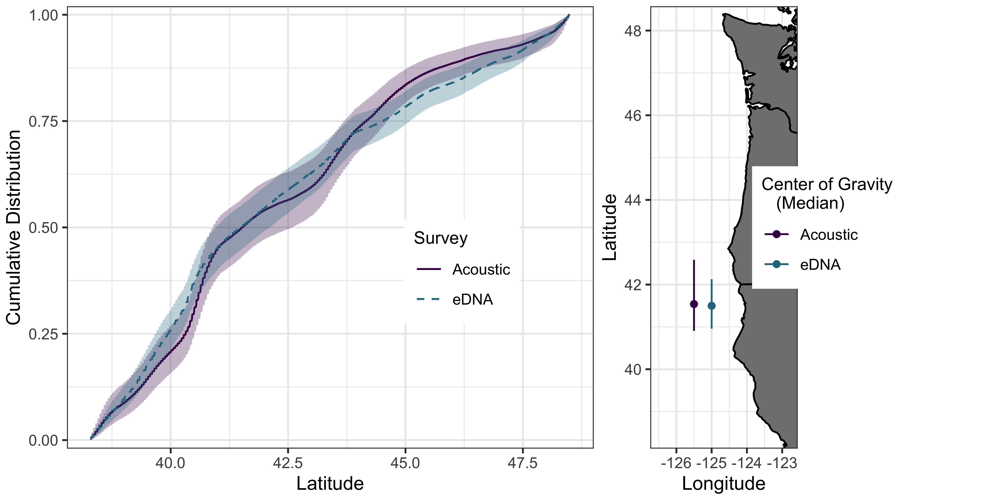

## Environmental DNA provides quantitative estimates of abundance and distribution in support of fisheries management.

Andrew Olaf Shelton$^{1*}$,  Ana Ram\'on-Laca$^2$, Abigail Wells$^3$, Julia Clemons$^{4}$, Dezhang Chu$^{4}$, Blake E. Feist$^1$, Ryan P. Kelly$^{5}$, Sandra L. Parker-Stetter$^{4\dagger}$, Rebecca Thomas$^{4}$, Krista Nichols$^1$, Linda Park$^1$

$^1$Conservation Biology Division, Northwest Fisheries Science Center, National Marine Fisheries Service, National Oceanic and Atmospheric Administration, 2725 Montlake Blvd. E, Seattle, WA 98112, U.S.A.  

$^2$CICOES, University of Washington at Northwest Fisheries Science Center, National Marine Fisheries Service

$^3$ Lynker Associates, Under contract to Northwest Fisheries Science Center, National Marine Fisheries Service, National Oceanic and Atmospheric Administration, 2725 Montlake Blvd. E, Seattle, WA 98112, U.S.A.  

$^{4}$Fisheries Resource Analysis and Monitoring Division, Northwest Fisheries Science Center, National Marine Fisheries Service, National Oceanic and Atmospheric Administration, 2725 Montlake Blvd. E, Seattle, WA 98112, U.S.A. 

$^{5}$ University of Washington, School of Marine and Environmental Affairs, 3707 Brooklyn Ave NE, Seattle, WA 98105, U.S.A. 

$^{\dagger}$ AFSC

$^{*}$ corresponding author: ole.shelton@noaa.gov

*Keywords*: 

<!-- \pagebreak -->
<!-- PNAS requirements: -->

<!-- Research reports describe the results of original research of exceptional importance. The preferred length of these articles is 6 pages, but PNAS allows articles up to a maximum of 12 pages. A standard 6-page article is approximately 4,000 words, 50 references, and 4 medium-size graphical elements (i.e., figures and tables). -->

<!-- Primary research -->
<!-- Article -->


\pagebreak
## Abstract

All creatures inevitably leave genetic traces in their environments, and the resulting environmental DNA (eDNA) therefore reflects the species present in a given habitat. It remains unclear, however, whether eDNA signals are sufficiently quantitative for use in regulatory or policy decisions on which human livelihoods or conservation successes may depend.  Here, we report the results of the largest eDNA ocean survey to date (spanning 86,000 km$^2$ to depths of 500m) to understand Pacific hake (*Merluccius productus*), the target of the largest finfish fishery along the west coast of the United States. We sampled eDNA in parallel with traditional acoustic survey methods and show how eDNA provides a spatially smooth signature of hake relative to the patterns seen in traditional acoustic survey methods. Despite local differences, when aggregated to management relevant scales the two methods yield comparable information about the broad-scale spatial distribution and abundance of hake. This occurs despite eDNA arising from a limited number of discrete samples within the larger acoustic survey. The analysis also yields novel information about depth-specific spatial patterns of eDNA at a large spatial scale with strong depth-specific patterns in eDNA abundance and variability. We demonstrate the potential power and efficacy of eDNA sampling for estimation of abundance and distribution and posit that eDNA methods have general quantitative applications that will prove especially valuable in data- or resource-limited contexts.

## Significance Statement

Need to write.

\pagebreak

## Introduction

Environmental DNA, in which the DNA from target organisms is collected from an environmental medium (e.g. soil or water), can detect species in a wide range of terrestrial, aquatic, and marine habitats [@thomsen2015environmental]. As a result, eDNA may efficiently survey species diversity and changes in community membership [@Boussarie2018sharks; @leempoel2020comparison; @nguyen2020environmental]. However, most applied natural resource questions depend upon estimates of abundance (e.g. fisheries or managing species of conservation concern) and for these topics, eDNA must provide information about abundance in order to be useful [@hansen2018sceptical]. While most studies find a positive relationship between eDNA concentrations and other survey methods [@rourke2021environmental], uncertainty about the strength of the eDNA-abundance relationship due to the complexity of eDNA generation, transport, degradation, and detection have limited the application of eDNA in many quantitative applications [@barnes2016ecology; @hansen2018sceptical;  @harrison2019predicting]. While the use of eDNA methods has grown exponentially from tens of publications in 2010 to over 600 in 2020 [@rourke2021environmental; @rodriguez2021biodiversity], reflecting widespread adoption of eDNA technologies, basic questions about the behavior of eDNA limit its practical application and slow its adoption in environmental management.

Rigorous, well designed surveys underlie the successful management and conservation of wild populations. But field surveys are expensive -- open oceans surveys involve ship time costing tens of thousands of dollars per day, for example -- and are typically tailored to a single or relatively narrow suite of species. eDNA methods are appealing for open-ocean or other difficult-to-sample locations because sampling can be fast, standardized, and non-lethal for many species simultaneously; sampling involves only the collection and processing of environmental samples [REF]. Even modest improvements in sampling efficiency from current surveys can reduce the duration of surveys, yield substantial cost savings for focal species surveys, and free survey time to be reallocated to other understudied communities. However, such broad-scale implementation depends upon providing eDNA-based estimates of abundance at management-relevant scales [@carraro2018estimating; @shelton2019biocons; @Fukaya2020estimating].

Observations of eDNA differ from traditional methods (e.g. visual [@port2016assessing; @tillotson2018concentrations], capture [@hanfling2016gillnet; @stoeckle2021trawl, @knudsen2019species], or acoustic [@Fukaya2020estimating] surveys) and the degree of agreement between individual samples of eDNA and traditional methods collected simultaneously often determines whether eDNA is viewed as successful or a failure [e.g. @Fukaya2020estimating; @stoeckle2021trawl]. However, eDNA observations arise from fundamentally different processes than observations from these traditional survey methods -- most dramatically, by exponential amplification of DNA molecules in an environmental sample [@kelly2019understanding; @mclaren2019consistent], but also because the distribution of eDNA itself in the environment often differs significantly from the distribution of its source organisms [@barnes2016ecology; @hansen2018sceptical;  @harrison2019predicting]. In the case of microbial eDNA, this distributional distinction is negligible, but for larger animals -- such as pelagic fishes or marine mammals -- it is not. Conceptually, fish are discrete, while the genetic traces they leave in the water are continuous, smoothing their environmental fingerprint over space and time.

If two methods are sampling different phenomena over different spatial or temporal scales, we expect individual observations collected at the same time and place from those methods to differ. For example, acoustic trawls used in surveys of pelagic fishes reflect the patchy density of schooling fishes. By comparison, we expect the associated eDNA to be distributed more evenly as a result of the lag between shedding and decay processes [@shelton2019biocons]. Understanding the ecology of eDNA [@barnes2016ecology] makes possible an honest assessment of the potential uses and limitations of eDNA for applied environmental problems, and lets us use each data stream to its best advantage. 

Here, we leverage the most spatially extensive eDNA survey of the oceans to date -- spanning over 86,000 km$^2$ across 10 degrees of latitude, an area of ocean approximately equivalent to the land area Portugal, and to depths of 500m -- to document the empirical patterns of eDNA for a commercially important and abundant species, Pacific hake (*Merluccius productus*). Hake is a semi-pelagic schooling species and is the most abundant species in the California Current Ecosystem [@malick2020relationships; @grandin2020assessment], supporting a large and important fishery along the Pacific coasts of US and Canada with coastwide catches in excess of 400,000t annually from 2017 to 2019 [@grandin2020assessment]. The rich datasets available for hake provide an opportunity to compare available information from traditional surveys with eDNA.

We demonstrate the presence of large-scale, depth-specific spatial patterns of hake DNA in the ocean ocean using a quantitative PCR assay. We show how eDNA can be aggregated to provide a depth-integrated index of hake abundance comparable to acoustic-trawl survey results used for fisheries stock assessments. Consistent with the different expected distributions of eDNA and acoustic-trawl data, the two indices are modestly correlated at local scales (tens of $km^2$) but very strongly correlated when aggregated to managment-relevant scales (thousands of $km^2$). We derive metrics of the species' spatial distribution consistent with acoustics results, and find that the eDNA survey provides nearly identical precision as the acoustic survey despite using far fewer individual samples. Our results show that eDNA methods can provide important information about abundance and distribution at management-relevant scales, provide relatively straightforward opportunities for supplementing existing surveys, and open the door for providing quantitative information for additional species that are currently un- or under-studied. Our results suggest eDNA approaches are a viable survey methodology for virtually all major marine fisheries species.


<!--[@dorazio2018ednaoccupancy] quantitative stuff for occupancy.
 [RPK stray thought] Fisheries stock assessments generally rely upon quantitative indices of species' abundances, rather than on estimates of biomass per se. At the spatial scale relevant to management, discrete eDNA samples and continuous trawl surveys/transects provide nearly identical information in terms of this index of abundance. -->


<!-- @article{thomsen2015environmental, -->
<!--   title={Environmental DNA--An emerging tool in conservation for monitoring past and present biodiversity}, -->
<!--   author={Thomsen, Philip Francis and Willerslev, Eske}, -->
<!--   journal={Biological conservation}, -->
<!--   volume={183}, -->
<!--   pages={4--18}, -->
<!--   year={2015}, -->
<!--   publisher={Elsevier} -->
<!-- } -->


\clearpage
<!--
EXTRA JUNK EXTRA JUNK EXTRA JUNK.


We and that eDNA has several appealing statistical characteristics of 

[@tillotson2018concentrations] SALMON

[@carraro2018estimating] PNAS Using river distribution models to estimate abundance (SPATIAL STUFF)

people who have made rinky-dink joint models:
[@chambert2018analytical] 

[@harrison2019predicting] Review of eDNA processes (production, transport, etc.)

[@hanfling2016gillnet] used gillnets in combination with metabarcoding, lakes.

[@stoeckle2021trawl] Metabarcoding and trawls. New Jersey.


Here we show how statistical methods from the fields of ecology and fisheries to bear on eDNA data and yield inference about the abundance and distribution of a commercially important fish, Pacific hake *Merc...*.  We focus on hake because the rich datasets available for this species provided an opportunity to compare and contrast available information with eDNA. We pair the largest eDNA survey of the coastal ocean to date (spanning ... ) to traditional acoustic-trawl methods conducted in parallel with eDNA samples to understand the 

We show how eDNA can simultaneously differ substantially from acoustics estimates at local scales (kms) and yet provide very similar patterns of abundace at large spatial scales.   

In addition, we illustrate how the patterns of hake eDNA vary substantially spatially and by depth, revealing new insights into the ecology of eDNA. Specifically, we show how small scale variability in eDNA appears to decline with depth, and does not follow  


Our work demonstrates that there is certainly a complex and interesting ecology of eDNA that needs additional study. While this complexity obscures the relationships 

eDNA has the potential to provide information simultaneously on a wide range of species including many that are currently unstudied.

resulting in species of economic importance, exceptional charisma, or severe conservation concern, being targeted for surveys while most species are ignored. In the context of a changing climate, this bias in surveys leaves us blind to shifting distributions... other things. 

A correlary to this fact is that we are treating eDNA samples as conceptually identical 

More importantly, the question of what can be reasonably inferred from a given eDNA data set 

Birds (Christmas counts), mammals (), fisheries  In the oceans,  

Integrated models are widely used in fisheries applications 

By analogy deep understanding of the ``ecology" of eDNA 

While the promise of eDNA has been widely described and associated laboratory methods have been widely reviewed, case     greatly democratise which species can be surveyed as 

sight unseen detection

* Behavior of dna in the world 
* Depth stratification - unveiling a third dimension
* Comparison acoustics to dna
* Interpretation depends on spatial scale; box of interest
* Transboundary; why matters for rules 
* Rarefaction - how little sample could we do and get same answer?


however, in most field applications that have relevance to management or conservation, the scale of interest is not the scale of an individual sample but how multiple samples can be combined to infer the status and trend of large units - a population, a meta-population, an evolutionary significant units, etc. -- 

Things that are interesting.

* 3D plot of hake by depth.
* methods of eDNA give and explicit estimate of detection thresholds.
* Comparison acoustics to dna
* Interpretation depends on spatial scale; box of interest
* Transboundary; why matters for rules 
* Rarefaction - how little sample could we do and get same answer?

 BREAK BREAK BREAK BREAK BREAK BREAK BREAK BREAK BREAK BREAK BREAK BREAK BREAK BREAK --> 
## Results

Hake were detected throughout the range of the survey but hake DNA was far more commonly detected than the acoustic backscatter. For the acoustic survey 36% (1,764 of 4,841) of the 0.5nm segments  were identified as having hake biomass. In contrast, 94% (1,670 of 1,769) of 2.5L water samples and 98% (875 of 892) of sampling stations had detectable hake DNA (two water samples were collected per station). (Need to finesse this line of results due to low level contamination concerns)

<!--
A <-  Output.summary.qpcr$dat.obs.bin %>% 
              group_by(samp_station_depth_idx,sample_idx) %>% 
              summarise(SUM =sum(Ct_bin),N=length(Ct_bin))

B <- A %>% filter(SUM == 0) 
dim(B)
1 - (nrow(B) /  nrow(A))


A <-  Output.summary.qpcr$dat.obs.bin %>% 
              group_by(samp_station_depth_idx) %>% 
              summarise(SUM =sum(Ct_bin),N=length(Ct_bin))

B <- A %>% filter(SUM == 0) 
dim(B)
1 - (nrow(B) /  nrow(A))
-->

Distributions of hake eDNA over 10 degrees of coastal ocean vary substantially with depth, with highest concentration observed between 100m and 300m along the continental shelf break and south of the Oregon-California border at 42$^{\circ}$N (Fig. \ref{fig:mean.maps}). Hake DNA concentration was far more homogeneous at depth than near the surface: concentrations at 500m were generally low and showed limited spatial variation, while the near-surface layers (3m, 50m) showed generally higher but more uncertain concentrations (Figs. \ref{fig:mean.maps}) due to larger variance at the level of individual sample bottles. Among the predicted grid cells, the median coefficient of variation (CV) was larger than 1 for both 3m and 50m but only about 0.3 for depths 100m and deeper (Fig. 1g). Such uncertainty reflects large observed differences DNA concentration between replicate samples taken at the same sample location and substantial differences among proximate sampling locations (see Supplement SX).

We combined DNA information between 50 and 500m to produce a depth-integrated estimate of hake DNA concentration comparable to acoustic-trawl surveys commonly used in assessing pelagic species worldwide (Fig. \ref{fig:surface.compare}). The eDNA index showed strong spatial patterning with highest values along the continental shelf break with notable peaks in central Califoria and Oregon waters.  In contrast, the acoustic-trawl results were highly spatially variable -- a common feature observed in acoustic surveys [REF] --  with some areas of very high hake density and others with very low density in close proximity. At the scale of individual 25km$^2$ grid cells, eDNA and acoustic surveys were positively correlated ($\rho$ = 0.523[INSERT CI], Pearson product-moment correlation; Fig. \ref{fig:pairwise}) but there is considerable scatter in the relationship. Large eDNA values never occurred at locations which had very low acoustic biomass, but very high acoustic estimates corresponded to moderate values of eDNA. Notably, across all 3,455 grid cells, acoustic biomass estimates had a very right-skewed distribution -- most values were near zero with very few high values -- while eDNA values were decidedly less skewed (Fig. \ref{fig:pairwise}). Taken together, these observations suggest a smoother distribution of residual genetic information relative to the patchier acoustic detections.

When aggregated to larger, management-relevant spatial scales, the correlation between eDNA and acoustics increased substantially ($\rho$ = 0.866[INSERT CI]; Fig. \ref{fig:pairwise}) with acoustics and eDNA scaling approximately linearly. Such increased correlation is not dependant upon the spatial groupings in Fig. \ref{fig:pairwise} (see Supplement SX for alternate spatial groupings). For biomass, eDNA and acoustic-trawls are providing nearly equivalent information about relative spatial abundance. At a coast-wide scale, the uncertainties (CVs) of the acoustic-trawl estimate and eDNA index were nearly identical (0.097 and 0.106, respectively). This similarity occurred despite the eDNA only being collected at 186 locations associated with CTD casts, whereas the acoustic-trawl data includes 4,841 individual acoustic segments and 45 mid-water trawls to determine age- and length-structure of the hake.

Finally, the two methods produced nearly identical distributional estimates, with nearly identical estimates of the center of gravity (median value within the projection range) and very similar cumulative distributions, with the $90\%$CIs overlapping for the entire latitudinal range (Fig. \ref{fig:COG}). 

<!-- 
Output.summary.qpcr$D_DNA_uncond_total
# A tibble: 1 x 11
     Mean  Median      SD  Q.0.01  Q.0.025  Q.0.05 Q.0.25 Q.0.75 Q.0.95 Q.0.975 Q.0.99
    <dbl>   <dbl>   <dbl>   <dbl>    <dbl>   <dbl>  <dbl>  <dbl>  <dbl>   <dbl>  <dbl>
1  6.00e6  5.94e6 637076.  5.10e6 5223590.  5.32e6 5.68e6 6.22e6 6.77e6  7.01e6 7.54e6

# A tibble: 1 x 11
     Mean  Median      SD  Q.0.01  Q.0.025  Q.0.05 Q.0.25 Q.0.75 Q.0.95 Q.0.975 Q.0.99
    <dbl>   <dbl>   <dbl>   <dbl>    <dbl>   <dbl>  <dbl>  <dbl>  <dbl>   <dbl>  <dbl>
1  1.94e6  1.92e6 187437.  1.56e6 1617867.  1.67e6 1.81e6 2.05e6 2.25e6  2.36e6 2.48e6

--> 

## Discussion

Ocean surveys generate large-scale, quantitative indices of species' abundances. At the spatial scale relevant to management for hake along the U.S. west coast, qPCR analysis of a limited number of discrete water samples provides nearly identical information to acoustic-trawl surveys despite far fewer observations of eDNA than of acoustics. While other efforts have developed quantitative methods for eDNA within rivers [@carraro2018estimating], lakes[REF], estuaries [@shelton2019biocons], and nearshore marine habitats [@Fukaya2020estimating], we produce the first large scale study that can serve as a template for use of eDNA in quantitative applications such as fisheries.

The kind of spatial-statistical model we report here is a first for eDNA, bringing the analysis of this new data stream into line with the methods currently used in quantitative natural-resources management [e.g. REFs ]. Despite the clear differences in biological processes resulting in eDNA signals versus those from acoustic trawls, these distinct data sets are both subject to rigorous analytical methods. We emphasize that eDNA data are processed independently from acoustic-trawl data; no information from the acoustics informs eDNA or vice versa. Thus, the implementation of eDNA surveys during the night provides a second survey of abundance for hake without requiring any additional days at sea. Ultimately, eDNA holds unprecedented potential for improving the precision of abundance surveys, particularly when conducted in concert with existing surveys. 

For determining an index of abundance over a very large area, we assert that eDNA works well because the concerns about the impact of transport, degredation, and other processes on the eDNA observed [@barnes2016ecology; @hansen2018sceptical; @harrison2019predicting] are largely moot. Hake DNA present within our survey boundaries was generated by hake present within the survey area; oceanographic processes like currents or upwelling are not of sufficient magnitude to transport meaningful amounts of water into or out of the survey domain on the time scale at which eDNA degrades [hours to days; @harrison2019predicting]. Such population closure assumptions are reasonable and allows us to treat eDNA observations as analogous to other traditional sampling methods. eDNA may be less amenable to applications focused on smaller temporal and spatial scales.

We emphasize that many challenges to implementing eDNA surveys remain.  Surveys are primarily valuable because they inform temporal trends; most surveys, particularly those of marine creatures, are not used as measures of absolute abundance but as measures of abundance relative to previous years [@grandin2020assessment, OTHERS]. It will take years to develop eDNA time-series that can meaningfully affect management. Despite the overall similarity of two surveys shown here, it is unwise at present to cross compare surveys among years (e.g. compare eDNA in 2019 with acoustic-trawl data from 2017). Furthermore, there are additional data streams needed for management applications that are not currently possible from eDNA. For example, data derived from actual physical specimens -- e.g. age, length, sex, or condition -- cannot be extracted from eDNA at present, though these are active areas of research [@adams2019beyond; OTHERS]. Thus, eDNA approaches should be regarded as a supplement to existing surveys, not as a replacement. 

Despite these limitations, the characteristics of eDNA survey have several advantages. First, the samples collected and analyzed here for hake can be re-analyzed for other species. Analyses using species-specific qPCR should provide similar quantitative data and multi-species eDNA approaches using metabarcoding provide information about many species simultaneously though metabarcoding may be difficult to link to abundance or biomass [@kelly2019understanding; @mclaren2019consistent]. Second, surveys of eDNA provide the potential for high levels of replication and precision; as many replicate samples as desired can be collected, enabling researchers to target and achieve a desired level of precision. This is often not possible for other sampling methods that involve capturing individuals. For example, repeatedly trawling a particular location will deplete the fish present, and therefore such repeated sampling is distinct from true replication. In theory there are few limits on replication and our results suggest that the amount of small scale variation between water samples declines with depth (Fig. \ref{fig:mean.maps}g, Fig. SX), suggesting that the amount of statistical noise and therefore the amount of sampling needed may vary concomitantly.

Short conclusion paragraph.


Hanging chads:

* Clean laboratory techniques and appropriate methods are hard and take dedicated space and personnel. Certainly requires additional crew and different expertise relative to current methods.    

* Similarity to hake biology from other sources, depth distribution [DORN and METHOT 1991, 1992], trying to track down these references. [@agostini2006relationship] shows average hake deph of about 200m.

* Talk about detecting larval and juvenile fish in eDNA.

<!-- We note that other approaches to eDNA involve surveying multiple species simultaneously using metabarcoding methods rather than the single species qPCR we present here. -->

<!-- most papers that use metabarcoding implicitly assume that eDNA accurately reflects abundance of the targeted community; all analyses that calculate common diversity or community metrics (e.g. Shannon diversity, Simpson diveristy, Bray-Curtis divergence) from eDNA are making the assumption that observed eDNA accurately reflects the true or at least the relative abundance of species within the sampled community. It has been well documented that this will rarely be true for most multi-species approaches (Kelly et al. 2019, Amy's paper, several others) and as such future work needs to focus on developing statistical approaches that can make metabarcoding data quantitative. -->

<!-- There have been some rinky-dink attempts to make joint models for eDNA and other methods [@chambert2018analytical; fukaya2020estimating] but they make the mistake of assuming that the area sampled by each method is equivalent (eDNA,individual  -->

\clearpage

## Methods

### Hake biology summary.


### Field sampling and processing for eDNA

We collected eDNA samples during the 2019 U.S.-Canada Integrated Ecosystem \& Acoustic-Trawl Survey for Pacific hake aboard the NOAA research vessel Bell M. Shimada from July 2 to August 19 [@deBlois2020survey]. We collected seawater from up to six depths (3, 50, 100, 150, 300, and 500m) at 186 CTD stations spread across 36 acoustic transects (Fig. \ref{fig:surface.compare}). We included 1,769 individual 2.5L water samples collected at 892 depth-station combinations (a small number of samples were contaminated or lost during processing). 710 depth-stations were collected at 50m deep or deeper. Two replicates of 2.5L of seawater were collected at each depth and station from independent Niskin bottles attached to a CTD rosette. Water samples from 3m were collected from the ship's salt water intake line but processed identically to Niskin samples. Nearly all CTD casts and therefore water collection for eDNA occurred at night.

To account for possible contamination negative sampling controls were collected routinely by filtering 2 L of distilled water from either the onboard evaporator or from distilled water brought from the laboratory for this purpose (N=49 in total). The water was filtered immediately after collection using 47 mm diameter mixed cellulose ester sterile filters with a 1 $\mu$m pore size using a vacuum pump. The filters were stored at room temperature in Longmire's buffer until DNA extraction. 

The DNA was extracted using a modified phenol:chloroform method with a phase lock to increase the throughput and yield. Quantification of Pacific hake was performed by qPCR using a specific TaqMan assay on a QuanStudio 6 (Applied Biosystems) that included an internal positive control (IPC) of the reaction to account for PCR inhibition. Any delay of more than 0.5 cycles from the IPC was considered inhibition and affected samples were purified using an inhibitor removal column before being diluted 1:2, 1:5 and 1:10 and requantified. For all diluted samples, we include the 1:5 dilution in all analyses (see below). Detailed protocols and laboratory analyses for all steps are provide in Ram\'on-Laca et al. [-@ramon-laca2021PLOS].

### Acoustic-trawl data

In parallel with water collection for eDNA, we incorporate data on hake biomass derived from the contemporaneously collected acoustic-trawl data [@deBlois2020survey]. We include data from 4,483 km of acoustics transects representing 57 acoustic transects. 45 midwater trawls were deployed that provide information on the age, size and therefore signal strength of hake [@deBlois2020survey; @grandin2020assessment]. We use derived estimates of biomass concentration ($mt$ $km^{-2}$) for ages 2 and older that integrate the biomass in the water column between depths of 50 and 500m in all analyses. All acoustic data and associated trawls were collected during daylight hours. Therefore there is a lag between collection of acoustic and eDNA data, though for nearly all cases collection were separated by less than 24 hours. Methods for converting raw acoustic and trawl data to biomass concentrations can be found in [@malick2020relationships; @grandin2020assessment] and references therein.

NOTE FOR RT, CHU, and JULIA - Does this provide enough information to satisfy you?  Additional information / sources needed?

<!-- 57 acoustic transects, (55 in projection range; including 22 and 23) -->
<!-- 4841 0.5nm long segments, 2420.5 nm of transects which is 4482.766 km of acoustic transects. -->

<!-- 34 transects with eDNA samples (36 if include 22 and 23) -->
<!-- 892 station-depths in total (6 are from transects 22 and 23, which are out of the projection range; excludes 25 samples); 710 are from depths of >50m. -->

### Spatial eDNA Model

We developed a Bayesian state-space framework for modeling DNA concentration in the coastal ocean.  State-space models separate the true biological process from the methods used to observe the process [REF]. We use a relatively simple process model.  Let $D_{xyd}$ be the true, but unobserved concentration of hake DNA (DNA $copies$ $L^{-1}$) present at spatial coordinates $\{x,y\}$ (northings and eastings, respectively, in km) and sample depth $d$ (meters). We model the DNA concentration as a spatially smooth process at each depth sampled ($d =$ 3, 50, 100, 150, 300, or 500m) and linear on the $\log_{10}$ scale,

\begin{align}
  & \log_{10}D_{xyd}=\gamma_d + s(b) + t_d(x,y)
\end{align}

where $\gamma_d$ is the spatial intercept for each depth, $s(b)$ indicates a smoothing spline of as a function of bottom depth in meters ($b$), and $t_d(x,y)$ is a tensor-product smooth that provides an independent spatial smooth for each depth. We use cubic regression splines for both univariate and tensor-product smoothes.

From this process model, we construct a multi-level observation model.  First, we model the DNA concentration in each Niskin bottle $i$, as a random deviation from the true DNA concentration at that depth and location and include three offsets to account for variation in the processing of eDNA extracted from Niskin bottles.
\begin{align}
  \log_{10}E_{i} &= \log_{10}D_{xyd} + \delta_i + \mathbf{I}\omega + \log_{10}{V_i} + \log_{10}{I_i} \\
  \delta_i & \sim Normal(0,\tau_d)
\end{align}
where $V_i$ is the proportion of 2.5 L filtered from Niskin $i$ (in nearly all cases $V_i = 1$), $I_i$ is the known dilution used to on sample $i$ to eliminate PCR inhibition, and $\mathbf{I}\omega$ is an estimated offset for a ethanol wash error ($\omega$ is the estimated effect of the wash error and $\mathbf{I}$ is an indicator variable where $\mathbf{I}=1$ for affected samples and $\mathbf{I}=0$ otherwise; see Supplement S1 for additional description).

When using qPCR, we do not directly observe eDNA concentration, we observe the PCR cycle at which each sample can be detected (or if it was never detected during the PCR). We use a hurdle model to account for the fact that there is a detection threshold (the PCR cycle of amplification is detected $G=1$ or it is not $G=0$). Conditional on being detected, we observe the PCR cycle ($C$) as a continuous variable that follows a normal distribution,

\begin{align}
  G_{ijr} &\sim Bernoulli(\phi_{0j}+\phi_{1j}\log_{10}E_{ij})\\
  C_{ijr} &\sim Normal(\beta_{0j}+\beta_{1j}\log_{10}E_{ij},\eta) \qquad  if \: G_{ijr} = 1
\end{align}

Here $j$ indexes the PCR plate on which sample $i$ and replicate $r$ were run. We conducted 3 PCR reactions for each $E_i$. Note that there are different intercept $(\phi_{0j},\beta_{0j})$ and slope $(\phi_{1j},\beta_{1j})$ parameters for the $j$th PCR plate to allow for among-plate variation.

To calibrate the relationship between the number of DNA copies and PCR cycle, each PCR plate has replicate samples with a known number of DNA copies. These standards span six orders of magnitude (1 to 100,000 copies) and determine the relationship between copy number and PCR cycle of detection. Let $K_j$ be the known copy number in PCR plate $j$, then,

\begin{align}
  G_{jr} &\sim Bernoulli(\phi_{0j}+\phi_{1j}\log_{10}K_{j})\\
  C_{jr} &\sim Normal(\beta_{0j}+\beta_{1j}\log_{10}K_{j},\sigma) \quad  if \: G_{jr} =1
\end{align}
where for the standards we do not allow for heavy tails in the observed PCR counts and use a normal likelihood rather than a t-distributed likelihood.

Not that the use of standards provides an explicit model for the detection threshold of eDNA when using qPCR and this detection threshold can be directly incorporated to understand the ability to measure DNA concentrations in field samples. We use diffuse prior distribution for all parameters (Table S1.X).  Posterior summaries of parameters can be found in Supplement S1. 


### Spatial acoustic-trawl model

In parallel with the model for qPCR data, we estimated a spatial model for the hake biomass derived from the acoustic-trawl survey. The biomass index created from the acoustic-trawl data for the entire survey area (34.4$^{\circ}$N to 54.7$^{\circ}$N) is used in stock assessments that determine the allowable catch and allocation of hake catch for fleets from the United States, Canada, and Tribal Nations [@grandin2020assessment]. As the eDNA samples only cover a portion of this range (38.3$^{\circ}$N to 48.6$^{\circ}$N), we used the biomass observations from the subset of transects on which we sampled eDNA to generate spatially smooth estimates of biomass. Acoustic transects are divided into 0.926km (0.5nm) segments and the biomass [age 2 and older; @grandin2020assessment] concentration  within each segment is used as data.

Unlike the eDNA data, age-specific biomass estimates are available only as a biomass integrated across the entire water column (from depths of 50 to 500m). We fit a Bayesian hurdle model using a form similar to the eDNA, modeling biomass concentration ($F_{xy}$; units: $mt km^{-2}$) using two separate spatial submodels: the probability of occurrence and a model for abundance conditional on the presence of hake. We model both components as a function of a smooth of bottom depth and a spatial smooth, 

\begin{align}
  H_{xy} &\sim Bernoulli(logit^{-1}(\zeta_H + s_H(b) + t_H(x,y))\\
  F_{xy} &\sim LogNormal(\zeta_F + s_F(b) + t_F(x,y) - 0.5\kappa^2,\kappa)
\end{align}

where $H_{xy}$ is 1 if the observed biomass concentration is non-zero and 0 otherwise. In this formulation, $\zeta$ is the spatial intercept for each model component, $s(b)$ indicates a smoothing spline of as a function of bottom depth in meters ($b$), and $t(x,y)$ is a tensor-product smooth for each model component.

### Model Estimation

We implemented both the eDNA and acoustic-trawl models using the Stan programing language as implemented in R (*Rstan*). All relevant code and data are provided in the online supplement. For the eDNA model, we ran 4 MCMC chains using 1500 warm up and 6000 sampling iterations. For the acoustic-trawl model, we ran 4 MCMC chains using 1000 warm up and 2000 sampling iterations.

We used traceplots and $\hat{R}$ diagnostics to confirm convergence ($\hat{R} < 1.01$ for all parameters). There were no divergent transitions in the sampling iterations. To generate matrices necessary for estimating smoothes we used the R package *brms* (REF). We use diffuse prior distribution for all parameters (Table S1.Y).  Posterior summaries of parameters can be found in Supplement S1.


### Coordinate systems, covariates, and spatial predictions

We project both the acoustic-trawl model and the eDNA model to a single grid to enable direct comparisons between methods. CHARACTERISTICS OF BLAKE's GRID [@feist2021footprints]

Blake will write a paragraph about area-weighted mean depth used as a covariate.
Bottom depth on this grid is depth-integrated across the entire grid cell.

To create a spatial prediction for eDNA and we take 4,000 draws from the joint posterior and generate predictions for the centroid of each grid cell and calculate posterior means and uncertainty bounds among posterior draws. Importantly, as DNA concentration were the values of interest, this projection is for $D_{xyb}$; we do not include the additional observation processes on top of the observed DNA concentration.  

Sentences on making projection for acoustic-trawl results.


### Creating an eDNA index 

Our model provides direct predictions for hake DNA concentration at depths of 50, 100, 150, 300, and 500m. To produce an index spanning depths of 50 to 500m, we need to equally weight depths between 50 and 500m. As we lack observations at other depths, we used linear interpolation between the closest depths using the posterior predictions at each depth to provide predicted DNA densities at 200, 250, 350, 400, and 450m for each 5km grid cell. For example, a prediction for a grid cell at 400m would be the mean of the predicted value for that grid cell from a single posterior draw for 300m and 500m. Because some spatial locations have depths of less than 500m, we only include predicted DNA concentrations to a depth appropriate for the bathymetry (e.g. a location with a depth of 180m only includes values from 50, 100 and 150m). We sum across all depths (between 50 and up to 500m) to generate a depth-integrated index of hake DNA. This index will be proportional to the hake DNA found in the water column. However, as we are only summing across discrete depths, not integrating values across the entire water column nor multiplying by the total water volume within each grid cell, the absolute value of the index will depend upon the number of discrete depths we use. As such, we refer to this as a DNA index to differentiate it from the predictions to a specific depths which have units of copies per liter.

## Acknowledgements

Funding for this project was provided by the NMFS Genomic Strategic Initiative. We thank Alicia Billings, John Pohl, OTHERS, and the crew of the RV Bell M. Shimada for their help organizing and implementing eDNA sampling. Jeanette Davis, X, and Y aided in the field processing water samples.

These people were important.  These people provided helpful feedback.

\newpage
\clearpage

```{r fig.mean.maps, echo=FALSE,fig.cap="\\label{fig:mean.maps} Predicted DNA concentration for six water depths show clear spatial patterning in DNA concentration (a-f; posterior mean). g) Uncertainty around the posterior mean for each water depth as measure by the coefficient of variation. The distribution among all projected 25km2 grid cells are shown (mean (circle), median (line), interquartile, and 90 CI are shown.  ",out.width='100%'}
knitr::include_graphics("./Pub_Figs/Hake_maps_Mean_depth_manual_facet_V2.jpeg")
```

```{r fig.surface.compare, echo=FALSE,fig.cap="\\label{fig:surface.compare} 2019 survey locations (left; red circles show eDNA sampling locations, lines show acoustic transects), depth-integrated  index of hake DNA (middle) and hake biomass from acoustic surveys (right).  Both DNA and acoustic estimates are mean predicted values projected to a 5km grid and include information between 50 and 500m deep. All panels show one degree latitudinal bins used to aggregate abundance estimates over larger spatial scales (see also Fig. 3).    ",out.width='100%'}

```

```{r fig.pairwise, echo=FALSE,fig.cap="\\label{fig:pairwise} Pairwise comparison between  DNA and acoustics-derived biomass. Left panel show the posterior mean prediction from each method among the 3,455 25km2 grid cells and includes the marginal histogram of posterior mean values for each method (RHO = 0.524[0.504,0.544]).  Right panel showes correlation between methods among the 11, one degree bins (posterior median[90 CI]; RHO = 0.868[0.631,0.956]). Numbers indicate associated region identified in Fig. 2.  ", out.width='100%'}

```

\clearpage

```{r fig.COG, echo=FALSE,fig.cap="\\label{fig:COG} Estimates of distribution from acoustic and eDNA methods. left: Cumulative distribution between 38.3 and 48.6N (posterior means, 90 CI). Right: Center of gravity (median of distribution) for each method (posterior means and 90 CI).  Only areas within the projection grid are included in this calculation (Figs. 1, 2).",out.width='100%'}

```

\clearpage

## Citations