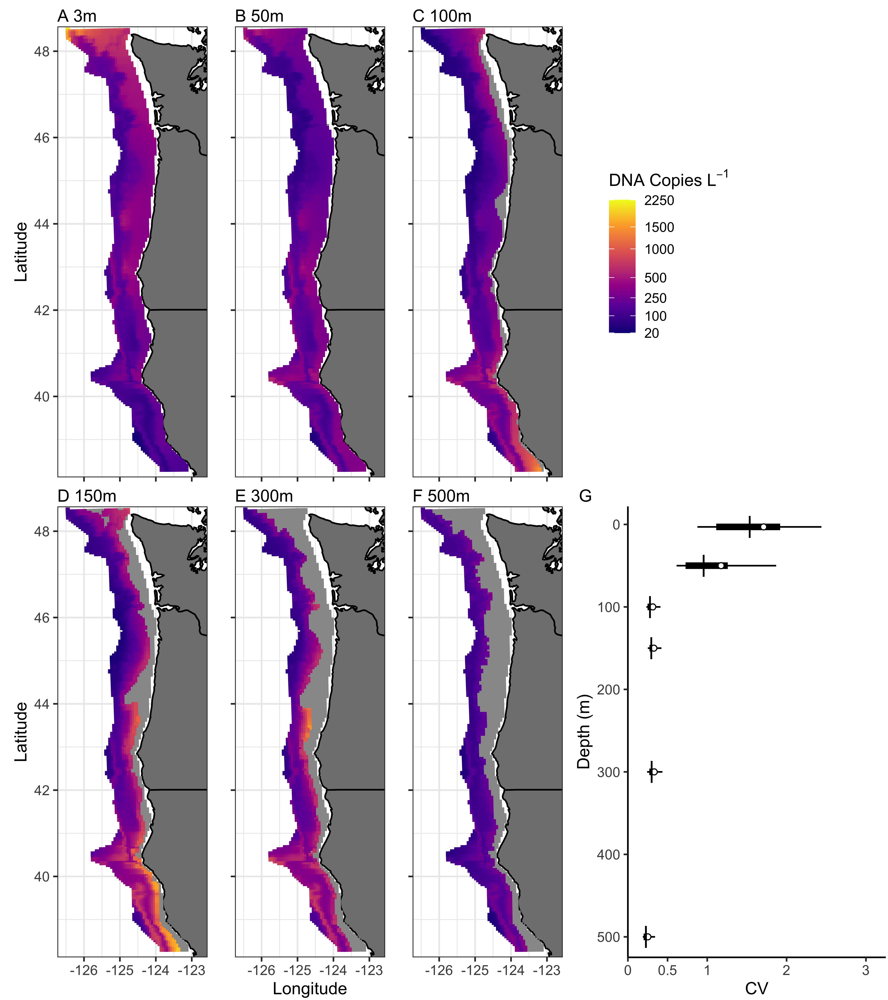

## Environmental DNA provides quantitative estimates of abundance and distribution in the open ocean.

Andrew Olaf Shelton$^{1*}$,  Ana Ram\'on-Laca$^2$, Abigail Wells$^3$, Julia Clemons$^{4}$, Dezhang Chu$^{4}$, Blake E. Feist$^1$, Ryan P. Kelly$^{5}$, Sandra L. Parker-Stetter$^{4,6}$, Rebecca Thomas$^{4}$, Krista Nichols$^1$, Linda Park$^1$

$^1$Conservation Biology Division, Northwest Fisheries Science Center, National Marine Fisheries Service, National Oceanic and Atmospheric Administration, 2725 Montlake Blvd. E, Seattle, WA 98112, U.S.A.  

$^2$CICOES, University of Washington at Northwest Fisheries Science Center, National Marine Fisheries Service

$^3$ Lynker Technologies, Under contract to Northwest Fisheries Science Center, National Marine Fisheries Service, National Oceanic and Atmospheric Administration, 2725 Montlake Blvd. E, Seattle, WA 98112, U.S.A.  

$^{4}$Fisheries Resource Analysis and Monitoring Division, Northwest Fisheries Science Center, National Marine Fisheries Service, National Oceanic and Atmospheric Administration, 2725 Montlake Blvd. E, Seattle, WA 98112, U.S.A. 

$^{5}$University of Washington, School of Marine and Environmental Affairs, 3707 Brooklyn Ave NE, Seattle, WA 98105, U.S.A. 

$^{6}$Resource Assessment & Conservation Engineering Division, Alaska Fisheries Science Center, National Marine Fisheries Service, National Oceanic and Atmospheric Administration, 7600 Sand Point Way NE, Seattle, WA 98115, WA

$^{*}$corresponding author: ole.shelton@noaa.gov

*Keywords*: 

<!-- \pagebreak -->
<!-- PNAS requirements: -->

<!-- Research reports describe the results of original research of exceptional importance. The preferred length of these articles is 6 pages, but PNAS allows articles up to a maximum of 12 pages. A standard 6-page article is approximately 4,000 words, 50 references, and 4 medium-size graphical elements (i.e., figures and tables). -->

<!-- Primary research -->
<!-- Article -->


\pagebreak
## Abstract

All species inevitably leave genetic traces in their environments, and the resulting environmental DNA (eDNA) therefore reflects the species present in a given habitat. It remains unclear, however, whether eDNA signals can provide quantitative metrics of abundance in regulatory or policy decisions on which human livelihoods or conservation successes depend. Here, we report the results of the largest eDNA ocean survey to date (spanning 86,000 km$^2$ to depths of 500m) to understand the abundance and distribution of Pacific hake (*Merluccius productus*), the target of the largest finfish fishery along the west coast of the United States. We sampled eDNA in parallel with traditional acoustic survey methods and show how eDNA provides a spatially smooth signature of hake relative to the patterns seen in traditional acoustic survey methods. Despite local differences, when aggregated to management-relevant scales the two methods yield comparable information about the broad-scale spatial distribution and abundance of hake. This occurs despite eDNA arising from a limited number of discrete samples within the larger acoustic survey. Furthermore, we find depth and spatial patterns of eDNA closely correspond to acoustic estimates for hake. We demonstrate the power and efficacy of eDNA sampling for estimation of abundance and distribution and posit that eDNA methods have general quantitative applications that will prove especially valuable in data- or resource-limited contexts.

## Significance Statement

<!-- We show for the first time how open ocean water samples analyzed for environmental DNA (eDNA) can provide quantitative estimates of abundance and distribution for a major fisheries species over a very large spatial scale. We show how eDNA provide comparable information to traditional fishery surveys and match available information on habitat- and depth-associations for hake. Our methods show that environmental DNA provide a general method for surveying a wide range of ocean species from basic water samples and open the door for rapid and widespread application of these methods for understanding ocean ecosystems. -->

We show for the first time how open-ocean water samples analyzed for environmental DNA (eDNA) can provide quantitative estimates of abundance and distribution for a major fisheries species over a very large spatial scale. eDNA provides comparable information to traditional fishery surveys and matches available information on habitat- and depth-associations for hake. Our methods are broadly useful for surveying a wide range of ocean species from water samples and open the door for rapid and widespread application of eDNA analysis for understanding ocean ecosystems. 

\pagebreak

## Introduction

Environmental DNA, the DNA from target organisms is collected from an environmental medium (e.g. soil or water), can reflect species in a wide range of terrestrial, aquatic, and marine habitats [@thomsen2015environmental]. eDNA has the potential to revolutionize our understanding of natural communities by enabling rapid and accurate surveys of many species simultaneously without capturing individuals [@thomsen2015environmental]. At present, eDNA can efficiently survey species diversity and changes in community membership [@Boussarie2018sharks; @leempoel2020comparison; @nguyen2020environmental]. However, many applied natural resource questions depend upon estimates of abundance (e.g. fisheries or managing species of conservation concern) and for these topics, eDNA must provide information about abundance in order to be most useful [@hansen2018sceptical]. While most studies find a positive relationship between eDNA concentrations and other survey methods REVIEWED IN [@rourke2021environmental], uncertainty about the strength of the eDNA-abundance relationship due to the complexity of eDNA generation, transport, degradation, and detection have limited the application of eDNA in many quantitative applications [@barnes2016ecology; @hansen2018sceptical;  @harrison2019predicting]. While the use of eDNA methods has grown exponentially from tens of publications in 2010 to over 600 in 2020 [@rourke2021environmental; @rodriguez2021biodiversity], reflecting widespread adoption of eDNA technologies, basic questions about the behavior of eDNA limit its practical application and slow its adoption in environmental management.

Rigorous, well designed surveys underlie the successful management and conservation of wild populations. But field surveys are expensive -- for example, open-ocean surveys involve ship time costing tens of thousands of dollars per day -- and are typically tailored to one or a few species. eDNA methods are appealing for open-ocean or other difficult-to-sample locations because sampling can be fast, standardized, and non-lethal for many species simultaneously; sampling involves only the collection and processing of environmental samples. Even modest improvements in sampling efficiency from current surveys can reduce the duration of surveys, yield substantial cost savings for focal species surveys, and free survey time to be reallocated to other understudied communities. However, such broad-scale implementation depends upon providing eDNA-based estimates of abundance at management-relevant scales [@carraro2018estimating; @shelton2019biocons; @Fukaya2020estimating].

Observations of eDNA differ from observations derived from traditional methods (e.g. visual [@port2016assessing; @tillotson2018concentrations], capture [@hanfling2016gillnet; @stoeckle2021trawl, @knudsen2019species], or acoustic [@Fukaya2020estimating] surveys) and the degree of agreement between individual samples of eDNA and traditional methods collected simultaneously often determines whether eDNA-based method are viewed as successful or not [e.g. @Fukaya2020estimating; @stoeckle2021trawl]. However, eDNA observations arise from fundamentally different processes than observations from these traditional survey methods -- most dramatically, by exponential amplification of DNA molecules in an environmental sample [@kelly2019understanding; @mclaren2019consistent], but also because the distribution of eDNA itself in the environment is not identical to the distribution of its source organisms [@barnes2016ecology; @hansen2018sceptical;  @harrison2019predicting]. In the case of microbial eDNA, this distributional distinction is negligible, but for larger animals -- such as fishes or marine mammals -- it is not. Conceptually, fish are discrete, while the DNA traces they leave in the water are continuous, smoothing their environmental fingerprint over space and time [@carraro2018estimating]. For example, acoustic trawls used in surveys of pelagic fishes reflect the patchy and skewed distribution of schooling fishes [@zwolinski2009estimating]. By comparison, we expect the associated eDNA to be distributed more evenly as a result of the lag between shedding and decay processes [@harrison2019predicting; @shelton2019biocons]. Understanding the ecology of eDNA [@barnes2016ecology] makes possible an honest assessment of the potential uses and limitations of eDNA for applied environmental problems, and lets us use each data stream to its best advantage.

Here, we leverage the most spatially extensive eDNA survey of the oceans to date -- spanning over 86,000 km$^2$ across 10 degrees of latitude, an area of ocean approximately equivalent to Portugal's land area, and to depths of 500m -- to document the empirical patterns of eDNA for a commercially important and abundant fish species, Pacific hake (*Merluccius productus*). Hake is a semi-pelagic schooling species and is the most abundant fish species in the California Current Ecosystem [@malick2020relationships; @grandin2020assessment], supporting a large and important fishery along the Pacific coasts of US and Canada with coastwide catches in excess of 400,000$mt$ annually in recent years [@grandin2020assessment]. The rich datasets available for hake provide an opportunity to rigorously compare available information from traditional surveys with eDNA using parallel statistical models that relate observations from each data type to quantitative indices of abundance.

We investigate large-scale and depth-specific spatial patterns of hake DNA in the open ocean using a quantitative PCR assay targeting the 12S mitochondiral gene region [@ramon-laca2021PLOS]. We show how eDNA can be aggregated to provide a depth-integrated index of hake abundance comparable to acoustic-trawl survey results used for fisheries stock assessments [@grandin2020assessment]. The spatial-statistical model we use is a first for eDNA in the ocean and make results for eDNA surveys comparable to other methods used in quantitative natural-resources management. Consistent with the different expected distributions of eDNA and acoustic data, the two indices are modestly correlated at local scales (tens of $km^2$) but very strongly correlated when aggregated to managment-relevant scales (thousands of $km^2$). We derive metrics of the species' spatial distribution consistent with acoustics results, and find that the eDNA survey provides nearly identical precision as the acoustic survey despite using far fewer individual samples. Our results show that eDNA analyses can provide important information about abundance and distribution at management-relevant scales, provide relatively straightforward opportunities for supplementing existing surveys, and open the door for providing quantitative information for additional species that are currently un- or under-studied. Our results suggest eDNA approaches are a viable quantitative survey methodology for marine species.


\clearpage

## Results

Hake were detected throughout the range of the survey, but hake DNA was far more commonly detected than the acoustic signature of hake. As expected for a patchily distributed species, acoustic sampling identified hake biomass in a minority of 0.983km long transect segments (see Methods; 1764 of 4841; 36%). By contrast, genetic signatures of hake were nearly ubiquitous, detected in 94% of water samples (1670 of 1769 2.5L samples) and 98% of sampling stations (875 of 892 stations), reflecting considerable spatial smoothing of the eDNA signal relative to the acoustic detections.

Distributions of hake DNA over 10 degrees of coastal ocean varied substantially with depth, with highest concentration between 100m and 300m depth along the continental shelf break and south of the Oregon-California border at 42$^{\circ}$N (Fig. \ref{fig:mean.maps}). Hake DNA concentration was far more homogeneous at depth than near the surface: concentrations at 500m were generally low and showed limited spatial variation, while the near-surface layers (3m, 50m) showed generally higher but more heterogeneous concentrations (Figs. \ref{fig:mean.maps}, S1.8) among individual sample bottles. The median coefficient of variation (CV) was larger than 1 for both 3m and 50m depths but only about 0.3 for depths 100m and deeper (Fig. 1G). Such uncertainty reflects large observed differences in DNA concentration between replicate samples taken at the same sample location and substantial differences among proximate sampling locations (see Supplement S1).

We combined DNA information between 50 and 500m to produce both a spatially smooth, depth-integrated estimate of hake DNA concentration (Fig. \ref{fig:surface.compare}B). Separately, we generated a spatially smooth estimate of age 2+ biomass from the acoustic-trawl survey (Fig. \ref{fig:surface.compare}C). Such analyses are commonly used in assessing pelagic species worldwide... **what we did is very sophisticated** . The eDNA biomass index showed strong spatial patterning with highest values along the continental shelf break with notable peaks in central Califoria and Oregon waters.  In contrast, acoustic-trawl results were highly spatially variable -- a common feature observed in acoustic surveys [@rivoirard2008geostatistics] --  with some areas of very high hake density and others with very low density in close proximity (see also Fig. S1.15). At the scale of individual 25$km^2$ grid cells, eDNA and acoustic surveys were modestly correlated ($\rho$ = 0.58[0.56, 0.60], Pearson product-moment correlation on posterior mean prediction [90\% CI]; Fig. \ref{fig:pairwise}) but there is considerable scatter in the relationship. Large eDNA values never occurred at locations which had very low acoustic biomass, but very high acoustic estimates corresponded to moderate values of eDNA. Notably, acoustic biomass estimates had a very right-skewed distribution across the 3,455 25$km^2$ ocean cells considered -- most values were near zero with very few high values -- while eDNA values were decidedly less skewed (Fig. \ref{fig:pairwise}). Taken together, these observations again suggest a smoother distribution of eDNA information relative to the patchier acoustic detections.

When aggregated to one degree latitude bins, the correlation between eDNA and acoustics increased substantially ($\rho$ = 0.87[0.63, 0.96]; Fig. \ref{fig:pairwise}) with acoustics and eDNA scaling approximately linearly. Such increased correlation is not dependant upon the spatial groupings in Fig. \ref{fig:pairwise} (see Fig. S1.13 and S1.14 results from an alternate spatial groupings). At this scale, eDNA and acoustic-trawls provide nearly equivalent information about relative biomass. At a coast-wide scale, the uncertainties (CVs) of the acoustic-trawl estimate and eDNA index were nearly identical (0.09 and 0.08, respectively). This similarity occurred despite the eDNA only being collected at 186 locations, whereas the acoustic-trawl data includes 4,841 acoustic transect segments and 45 mid-water trawls to determine age- and length-structure of the hake.

Finally, the two methods produced nearly identical latitudinal distributional estimates as measured by center of gravity (median value within the projection range) and cumulative distribution ($90\%$CIs overlapping for the entire latitudinal range; Fig. \ref{fig:COG}). Furthermore, averaged across space, hake DNA concentrations were highest along the continental shelf break (bottom depths between 125 and 400m) and at water depths between 150m and 300m (Fig. \ref{fig:COG}C). All of these observations are consistent with published descriptions of hake depth and habitat preferences [@methot1995biology; @agostini2006relationship; @malick2020relationships; @grandin2020assessment]

## Discussion

Ocean surveys are often used to generate large-scale, quantitative indices of species' abundances. At the spatial scale relevant to management for hake along the U.S. west coast -- our survey region encompasses the majority of habitat for the Pacific hake stock -- analysis of a limited number of discrete water samples for eDNA provides comparable indices of hake biomass to acoustic-trawl surveys despite far fewer eDNA observations. While other efforts have developed quantitative methods for eDNA within rivers [@carraro2018estimating], lakes [@hanfling2016gillnet; @buxton2017seasonal], estuaries [@shelton2019biocons], and nearshore marine habitats [@Fukaya2020estimating], we produce the first large-scale study that can be a template for using eDNA to determine abundance and species distributions with clear practical applications to both conservation and fisheries. Importantly, we push beyond sample-to-sample comparisons of alternate sampling methods and make comparisons at the population-scale. The spatial scale investigated here (tens of thousands of $km^2$ or more) is roughly comparable to the scale at which most large ocean fisheries are managed both in the United States and internationally, suggesting eDNA approaches can begin to be broadly adopted for that purpose. 

The kind of spatial-statistical model we report here is a first for eDNA, bringing the analysis of this new data stream into line with the methods currently used in quantitative natural-resources management e.g. [@maunder2004standardizing; @thorson2015geostatistical]. Despite the clear differences in biological processes resulting in eDNA signals versus those from acoustic trawls, these distinct data sets are both subject to rigorous analytical methods. We emphasize that eDNA data here are processed independently from acoustic-trawl data; no information from the acoustics informs eDNA or vice versa. Thus, the implementation of eDNA surveys provides a second survey of abundance for hake without requiring any additional days at sea (see *Methods*), a fact that should result in increased estimation precision for fish abundance when the two indices are incorporated into a stock assessment. Ultimately, eDNA holds unprecedented potential for improving the precision of abundance surveys, particularly when conducted in concert with existing surveys. 

For determining an index of abundance over a very large area, we assert that eDNA works well because the concerns about the impact of DNA transport, degredation, and other processes [@barnes2016ecology; @hansen2018sceptical; @harrison2019predicting] are negligable for our application (providing an index of abundance on large spatial scales). Hake DNA present within our survey boundaries was generated by hake present within the survey area; oceanographic processes like currents or upwelling are not of sufficient magnitude to transport meaningful amounts of water into or out of the survey domain on the time scale at which eDNA degrades [hours to days; @harrison2019predicting, @murakami2019dispersion]. Similarly, rates of DNA degradation are expected to be consistent across our sampling domain -- cool, offshore, oceanic waters below 50m with relatively little among-sample variation in temperature, salinity, and other covariates identified as important for degradation [@collins2018persistence; @andruszkiewicz2021environmental]. Such population closure and constant rate assumptions are reasonable (see also [@Fukaya2020estimating]) and allow us to treat eDNA observations as analogous to other traditional sampling methods. We note that our modeling framework provides the flexibility to directly include relevant covariates into the observation model to account for relevant DNA processes if and when such information becomes available (see *Methods* and *Supplement S1*). For hake, our eDNA results match available geospatial (Figs. \ref{fig:surface.compare}, \ref{fig:COG}) and depth-specific patterns of hake abundance [@agostini2006relationship; @malick2020relationships] (Fig. \ref{fig:COG}) from other methods, strongly suggesting our assumptions are reasonable and justified. eDNA approaches may be less effective in applications focused on smaller temporal and spatial scales such as detailed habitat-association studies where the precise locations of individuals are required (but see [@pont2018environmental; @jeunen2019environmental]). 

Many challenges to implementing eDNA surveys remain.  Surveys are primarily valuable because they inform temporal trends; most surveys, particularly those of marine species, are not used as measures of absolute abundance but as indicies of abundance relative to previous years [@maunder2004standardizing; @grandin2020assessment]. It will accordingly require years to  acummulate the kinds of eDNA-based time series that underpin current management. Furthermore, there are additional data streams needed for management applications that are not currently possible from eDNA. For example, physical specimens are needed to document age, size, sex, and condition, all of which cannot be extracted from eDNA at present, though these are active areas of research [@adams2019beyond; @mayne2020aging]. At present, eDNA approaches should be regarded as supplementing existing surveys, not replacing them. 

Despite these limitations, the characteristics of eDNA surveys have several advantages. First, the samples collected and analyzed here for hake can be re-analyzed for other species. Analyses using species-specific qPCR should provide similar quantitative data for additional species. DNA metabarcoding approaches can detect many species simultaneously [@thomsen_detection_2012], but metabarcoding results are difficult to link to abundance or biomass [@kelly2019understanding; @mclaren2019consistent]. Second, surveys of eDNA provide the potential for high levels of replication and precision; as many replicate samples as desired can be collected, enabling researchers to target and achieve a desired level of precision. This is often not possible for other sampling methods that involve capturing individuals. For example, repeatedly trawling a particular location will deplete the fish present, and therefore such repeated sampling is not helpful for estimating abundance. In theory there are few limits on replication using eDNA and our results suggest that the amount of small-scale variation between water samples declines with depth (Fig. \ref{fig:mean.maps}g, Fig. S1.9), suggesting that the amount of statistical noise and therefore the amount of sampling needed may vary concomitantly. It is wholly unknown if other marine species will 
 
We developed and applied our eDNA approach to Pacific hake because or it's broad geographic range, economic importance, and decades of associated survey information. The ability of eDNA to provide similar indices of abundance and distribution to existing surveys lend strong support for the applicability of eDNA methods to the unstudied majority of species in ocean ecosystems.

\clearpage

## Methods

### Hake biology summary 

Pacific hake are a schooling, semi-pelagic fish that are a key component of the California Current ecosystem as both predator and prey, migrating to the surface at night and back to mid-water depths during the day [@ressler2007pacific]. They are targeted by major fisheries in both the United States and Canada [@grandin2020assessment] and adults perform seasonal migrations between southern spawning areas and northern foraging areas [@methot1995biology; @ressler2007pacific; @malick2020relationships] In 2019, the ex-vessel value of commercial landings was more than $64 million. (MAKE REF NOAA Fisheries commercial fish landings database: https://www.fisheries.noaa.gov/foss/f?p=215:200:12162592413632:Mail:NO:::)

### Field sampling and processing for eDNA

We collected eDNA samples during the 2019 U.S.-Canada Integrated Ecosystem \& Acoustic-Trawl Survey for Pacific hake aboard the NOAA Ship *Bell M. Shimada* from July 2 to August 19 [@deBlois2020survey]. Detailed collection protocols and laboratory analyses for all steps are provided in Ram\'on-Laca et al. [-@ramon-laca2021PLOS]. We briefly summarize those protocols here.

We collected seawater from up to six depths (3, 50, 100, 150, 300, and 500m) at 186 station where a Conductivity Temperature and Depth (CTD) rosette was deployed.  These stations were spread across 36 acoustic transects (Fig. \ref{fig:surface.compare}). We included 1,769 individual water samples collected at 892 depth-station combinations (a small number of samples were contaminated or lost during processing). 710 depth-stations were collected at 50m deep or deeper. Two replicates of 2.5L of seawater were collected at each depth and station from independent Niskin bottles attached to a CTD rosette. Water samples from 3m were collected from the ship's salt water intake line but processed identically to Niskin samples. Nearly all CTD casts and therefore water collection for eDNA occurred at night while acoustic sampling (see below) took place during daylight hours.

To account for possible contamination, negative sampling controls were collected routinely by filtering 2 L of distilled water from either the onboard evaporator or from distilled water brought from the laboratory for this purpose (N=49 in total). The water was filtered immediately after collection using 47 mm diameter mixed cellulose ester sterile filters with a 1 $\mu$m pore size using a vacuum pump. The filters were stored at room temperature in Longmire's buffer until DNA extraction [@renshaw2015room]. 

The DNA was extracted using a modified phenol:chloroform method with a phase lock to increase the throughput and yield. Quantification of Pacific hake was performed by qPCR using a specific TaqMan assay on a QuanStudio 6 (Applied Biosystems) that included an internal positive control (IPC) of the reaction to account for PCR inhibition. Any shift of more than 0.5 cycles from the IPC at the non-template controls of the PCR was considered inhibition and affected samples were purified using an inhibitor removal column for a subset of samples before being diluted 1:2, 1:5 and 1:10 for the rest and requantified. For all diluted samples, we include the 1:5 dilution in all analyses (see below). 

### Acoustic-trawl data

In parallel with water collection for eDNA, we incorporate data on hake biomass derived from the contemporaneously collected acoustic-trawl data [@deBlois2020survey], consisting of 57 transects totaling 4,483 km in length. 45 midwater trawls were deployed that provide information on the age, size and therefore signal strength of hake [@deBlois2020survey; @grandin2020assessment]. Methods for converting raw acoustic and trawl data to biomass concentrations can be found in [@malick2020relationships; @grandin2020assessment] and references therein. We use derived estimates of biomass concentration ($mt$ $km^{-2}$) for hake ages 2 and older that integrate the biomass in the water column between depths of 50 and 500m in all analyses. All acoustic data and associated trawls were collected during daylight hours. Therefore there is a lag between collection of acoustic and eDNA data, though for nearly all cases collection were separated by less than 24 hours. The temporal separation of eDNA and acoustic sampling preclude direct comparisons at the single-sample level. 

### Spatial eDNA Model

We developed a Bayesian state-space framework for modeling DNA concentration in the coastal ocean.  State-space models separate the true biological process from the methods used to observe the process. We use a relatively simple process model. Let $D_{xyd}$ be the true, but unobserved concentration of hake DNA (DNA $copies$ $L^{-1}$) present at spatial coordinates $\{x,y\}$ (northings and eastings, respectively, in km) and sample depth $d$ (meters). We model the DNA concentration as a spatially smooth process at each depth sampled ($d =$ 3, 50, 100, 150, 300, or 500m) and linear on the $\log_{10}$ scale,

\begin{align}
  & \log_{10}D_{xyd}=\gamma_d + s(b) + t_d(x,y)
\end{align}

where $\gamma_d$ is the spatial intercept for each depth, $s(b)$ indicates a smoothing spline of as a function of bottom depth in meters ($b$), and $t_d(x,y)$ is a tensor-product smooth that provides an independent spatial smooth for each depth. We use cubic regression splines for both univariate and tensor-product smoothes. We investigated a range of 

From the process model in eq. 1, we construct a multi-level observation model.  First, we model the DNA concentration in each Niskin bottle $i$, as a random deviation from the true DNA concentration at that depth and location and include three offsets to account for variation in the processing of eDNA extracted from Niskin bottles.
\begin{align}
  \log_{10}E_{i} &= \log_{10}D_{xyd} + \delta_i + \log_{10}{V_i} + \log_{10}{I_i}  + \mathbf{I}\omega\\
  \delta_i & \sim Normal(0,\tau_d)
\end{align}
where $V_i$ is the proportion of 2.5 L filtered from Niskin $i$ (in nearly all cases $V_i = 1$), $I_i$ is the known dilution used to on sample $i$ to eliminate PCR inhibition, and $\mathbf{I}\omega$ is an estimated offset for an ethanol wash error ($\omega$ is the estimated effect of the wash error and $\mathbf{I}$ is an indicator variable where $\mathbf{I}=1$ for affected samples and $\mathbf{I}=0$ otherwise; see Supplement S1 for additional description).

When using qPCR, we do not directly observe eDNA concentration, we observe the PCR cycle at which each sample can be detected (or if it was never detected). We use a hurdle model to account for the fact that there is a probabilistic detection threshold (the PCR cycle of amplification is detected $G=1$ or is not observed $G=0$). Conditional on being detected, we observe the PCR cycle ($C$) as a continuous variable that follows a T distribution,

\begin{align}
  G_{ijr} &\sim Bernoulli(\phi_{0j}+\phi_{1j}\log_{10}E_{ij})\\
  C_{ijr} &\sim T(\nu,\beta_{0j}+\beta_{1j}\log_{10}E_{ij},\eta) \qquad  if \: G_{ijr} = 1
\end{align}

Here $j$ indexes the PCR plate on which sample $i$ and replicate $r$ were run. We conducted 3 PCR reactions for each $E_i$. We fix the degrees of freedom for the t-distribution ($\nu = 3$) to allow for heavy-tailed observations. Note that there are different intercept $(\phi_{0j},\beta_{0j})$ and slope $(\phi_{1j},\beta_{1j})$ parameters for each PCR plate to allow for among-plate variation in amplification.

To calibrate the relationship between the number of DNA copies and PCR cycle, each PCR plate has replicate samples with a known number of DNA copies. These standards span six orders of magnitude (1 to 100,000 copies) and determine the relationship between copy number and PCR cycle of detection. Let $K_j$ be the known copy number in PCR plate $j$, then,

\begin{align}
  G_{jr} &\sim Bernoulli(\phi_{0j}+\phi_{1j}\log_{10}K_{j})\\
  C_{jr} &\sim Normal(\beta_{0j}+\beta_{1j}\log_{10}K_{j},\sigma) \quad  if \: G_{jr} =1
\end{align}
where for the standards we do not allow for heavy tails in the observed PCR counts and use a normal likelihood rather than a T-distributed likelihood.

Note that the use of standards provides an explicit model for the detection threshold of eDNA when using qPCR and this detection threshold can be directly incorporated to understand the ability to measure DNA concentrations in field samples. We use diffuse prior distribution for all parameters (Table S1.1).  Posterior summaries of parameters can be found in Supplement S1. 

### Spatial acoustic-trawl model

In parallel with the model for qPCR data, we estimated a spatial model for the hake biomass derived from the acoustic-trawl survey. The biomass index created from the acoustic-trawl data for the entire survey area (34.4$^{\circ}$N to 54.7$^{\circ}$N) is used in stock assessments that determine the allowable catch and allocation of hake catch for fleets from the United States, Canada, and Tribal Nations [@grandin2020assessment]. As the eDNA samples only cover a portion of this range (38.3$^{\circ}$N to 48.6$^{\circ}$N), we used the biomass observations within this latitudinal range to generate spatially smooth estimates of biomass. Acoustic transects are divided into 0.926km (0.5nm) segments and the biomass (age 2 and older) concentration within each segment is used as data [@grandin2020assessment].

Unlike the eDNA data, age-specific biomass estimates are available only as a biomass integrated across the entire water column (from depths of 50 to 500m). We fit a Bayesian hurdle model using a form similar to the eDNA, modeling biomass concentration ($F_{xy}$; units: $mt$ $km^{-2}$) using two separate spatial submodels: a) the probability of occurrence and b) abundance conditional on the presence of hake. We model both components as a function of bottom depth (smooth) and a spatial smooth, 

\begin{align}
  H_{xy} &\sim Bernoulli(logit^{-1}(\zeta_H + s_H(b) + t_H(x,y))\\
  F_{xy} &\sim LogNormal(\zeta_F + s_F(b) + t_F(x,y) - 0.5\kappa^2,\kappa) \quad  if \: H_{xy} = 1
\end{align}

where $H_{xy}$ is 1 if the observed biomass concentration is non-zero and 0 otherwise. In this formulation, $\zeta$ is the spatial intercept for each model component, $s(b)$ indicates a smoothing spline of as a function of bottom depth in meters ($b$), and $t(x,y)$ is a tensor-product smooth over latitude and longitude. $\kappa$ is the standard deviation of the positive observations on the log scale.

### Model Estimation

We implemented both the eDNA and acoustic-trawl models using the Stan programing language as implemented in R (*Rstan*). All relevant code and data are provided in the online supplement. For the eDNA model, we ran 4 MCMC chains using 1500 warm up and 9000 sampling iterations. For the acoustic-trawl model, we ran 4 MCMC chains using 1200 warm up and 3000 sampling iterations.

We used traceplots and $\hat{R}$ diagnostics to confirm convergence ($\hat{R} < 1.01$ for all parameters) -- there were no divergent transitions in the sampling iterations. To generate design matrices necessary for estimating covariate effects we used the R package *brms* [@brms2017; @brms2018]. We use diffuse prior distribution for all parameters (Table S1.1).  Posterior summaries of parameters can be found in Supplement S1 and in the associated supplemental files.

### Coordinate systems, covariates, and spatial predictions

We generated 5km resolution gridded maps for both the acoustic-trawl and eDNA models to enable direct comparisons between models. This vector-based grid was developed and used by others [@feist2021footprints] for interpolating various spatial models and uses a custom coordinate reference system that conserves area and distance reasonably well across the west coast of the United States (Supplement S1). The 5km spatial grain was a suitable resolution for the purposes of our analyses.

We used Esri ArcGIS (v. 10.1) and R to calculate an area-weighted mean (AWM) depth for each of the 5km grid cells using a high-resolution composite bathymetry grid that was generated and previously analyzed by Feist et al. [@feist2021footprints]. The bathymetry grid was a finer spatial resolution (3-arcsecond or ~86 m cell size) than the 5km grid, so the 5km vector grid was converted to a raster of the same resolution, whereby all of the 3-arcsecond grid cells corresponding to a given 5km grid cell were assigned a unique integer value. The land portions of 5km grid cells that spanned land and water were masked from the AWM calculations. The rasterized 5km and bathymetry grids were then combined, and we used the resulting value attribute table to calculate AWM for each of the 5km grid cells.

To create spatial predictions for both eDNA and acoustic-trawl models, we took 4,000 draws from the joint posterior and generated predictions for the centroid of each grid cell. We calculated posterior means and uncertainty bounds among posterior draws. For the eDNA model we made projections for $D_{xyb}$; we do not present results from including additional observation processes on top of the estimated DNA concentrations. We did generate posterior predictive distributions for other model diagnostics checks.

### Creating an eDNA index 

Our model provides direct predictions for hake DNA concentration at depths of 50, 100, 150, 300, and 500m. To produce an index spanning depths of 50 to 500m, we need to equally weight depths between 50 and 500m. As we lack observations at other depths, we used linear interpolation between the closest depths using the posterior predictions at each depth to provide predicted DNA densities at 200, 250, 350, 400, and 450m for each 5km grid cell. For example, a prediction for a grid cell at 400m would be the weighted average of the value for that grid cell from a single posterior draw for 300m and 500m (with equal weights assigned to 300 and 500m). Because some spatial locations have depths of less than 500m, we only include predicted DNA concentrations to a depth appropriate for the bathymetry (e.g. a location with a depth of 180m only includes values from 50, 100 and 150m). We sum across all depths (between 50 and up to 500m) to generate a depth-integrated index of hake DNA. This index will be proportional to the hake DNA found in the water column. However, as we are only summing across discrete depths, not integrating values across the entire water column nor multiplying by the total water volume within each grid cell, the absolute value of the index will depend upon the number of discrete depths we use. As such, we refer to this as a eDNA biomass index to differentiate it from the predictions to specific depths which have units of copies per liter.

## Acknowledgements

Funding for this project was provided by the NMFS Genomic Strategic Initiative. Special thanks to S. Allen, B. Dewees, J. Witmer and J. Davis for assistance during sample collection and the captain and crew of the NOAA ship *Bell M. Shimada* for overall support during the shipboard collection effort. E. Iwamoto and other members of the molecular genetics lab at the Northwest Fisheries Science Center supported laboratory work. **A. Billings, J. Pohl, D. Chu,** 

A. Berger, M.J. Ford, and J.F. Samhouri provided helpful comments on earlier versions of the manuscript.

We thank 

 

These people were important.  These people provided helpful feedback.

\newpage
\clearpage

```{r fig.mean.maps, echo=FALSE,fig.cap="\\label{fig:mean.maps} Predicted DNA concentration for six water depths shows clear spatial patterning in DNA concentration (A-F; posterior mean). G) Uncertainty around the posterior mean for each water depth as measure by the coefficient of variation. The distribution among all projected 25km2 grid cells are shown (mean (circle), median (line), interquartile, and 90 CI).  ",out.width='100%'}

```

```{r fig.surface.compare, echo=FALSE,fig.cap="\\label{fig:surface.compare} 2019 survey locations (A; red circles show eDNA sampling locations, lines show acoustic transects), depth-integrated  index of hake DNA (B) and hake biomass from acoustic surveys (C).  Both DNA and acoustic estimates are mean predicted values projected to a 5km grid and include information between 50 and 500m deep. All panels show one degree latitudinal bins used to aggregate abundance estimates over larger spatial scales (see also Fig. 3).    ",out.width='100%'}
knitr::include_graphics("./Pub_Figs/Hake_maps_combined_to_surface.pdf")
```

```{r fig.pairwise, echo=FALSE,fig.cap="\\label{fig:pairwise} Pairwise comparison between  DNA and acoustics-derived biomass. A) posterior mean prediction from each method among the 3,455 25km2 grid cells and includes the marginal histogram of posterior mean values for each method (RHO = 0.58[0.56,0.60]).  B) correlation between methods among the 11, one degree bins (posterior mean[90 CI]; RHO = 0.87[0.64, 0.96]). Numbers indicate regions identified in Fig. 2.  ", out.width='100%'}
knitr::include_graphics("./Pub_Figs/Hake_point-level_and_1_degree.jpeg")
```

\clearpage

```{r fig.COG, echo=FALSE,fig.cap="\\label{fig:COG} Estimates of distribution of Pacific hake. A) Cumulative distribution between 38.3 and 48.6N (posterior means, 90 CI). B) Center of gravity (median of distribution) for each method (posterior means and 90 CI; only areas within the projection grid are included in this calculation ; see Figs. 1, 2). C) Posterior estimates hake DNA concentration at each station-depth combination by the water depth sampled and categories of the depth of the bottom. The distribution of mean DNA concentraion among station-depths (mean, interquartile range, and 90 CI among station-depths). Bottles at a sample location become increasingly similar at deeper sampling depths ",out.width='100%'}
knitr::include_graphics("./Pub_Figs/Hake_compare_distribution_plus_depth.jpeg")
```


\clearpage

## Citations